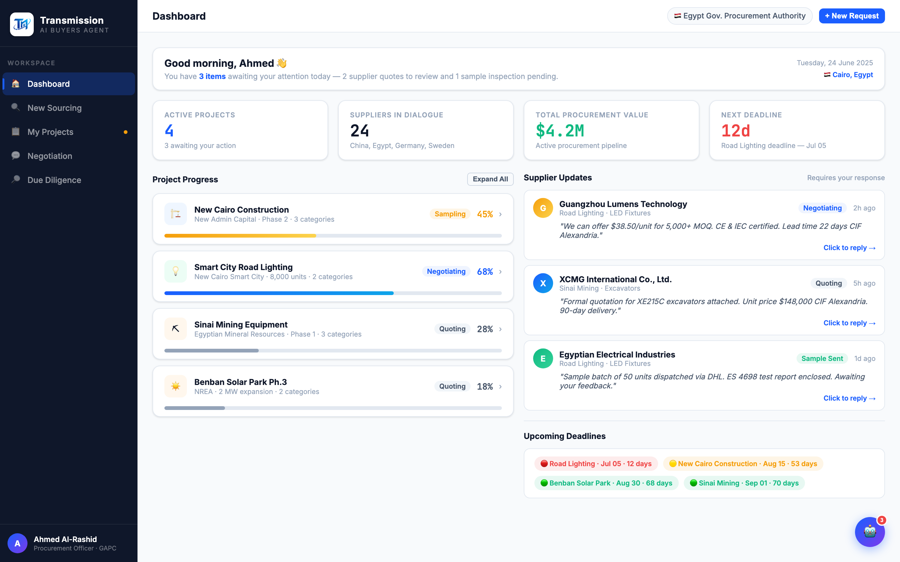

# Round 001 · ⬜ Utility · 真实 logo 接入

- **时间**:2026-06-25
- **档位**:⬜ Utility(机检 + 肉眼过 → 落库)
- **backlog 来源**:§8「真实 logo 接入(用户点名,影响高·把握高·风险低,优先做)」

## 做了什么
1. `.brand-icon`(CSS L26):`linear-gradient(135deg,#1B5EFF,#0EA5E9)` 蓝渐变方块 + 字母「T」占位 → **38px 白色圆角 chip** `background:#fff;border-radius:9px` + 克制阴影;内嵌 ``(30px)。白 chip 解决暗 navy 侧栏(`#0F172A`)对比问题(monogram 深蓝笔画直接放会糊)。
2. 侧栏 markup(L492):`
T
` → `

`;`.brand-name`/`.brand-sub` 文字保留。
3. head:加 `<link rel="icon" type="image/png" href="logo/logo-mark.png">` favicon。

## 验收
- **console 零错**:纯静态 markup/CSS 改动,未触 JS;img 在截图中成功渲染 → 路径解析、无 404、无新 console 报错 ✓(注:以渲染成功 + 逻辑自检为闸门,非实时 console 抓取)
- **动态行为**:未改动 ✓
- **跨视图抽查**:侧栏为 5 视图共用容器,logo 全局生效;未影响布局 ✓
- **3 critic 两轴**:
  - 【视觉:高级感 / 零 AI 味 / 对比度】**KEEP** — 去除明显 AI 占位件(渐变方块假字母),换真实品牌 monogram,白 chip 在 navy 上清晰、透明不脏、对比足。
  - 【产品:买方零负担 / 真人感】**KEEP** — 品牌可信度↑,无新增买方操作,无退步。
  - 【对比度 / 清晰度】**KEEP** — 30px monogram 在白 chip 上锐利可辨。
  - 裁决:**3/3 KEEP ✓**

## 截图

## 残留 → backlog
- 供应商卡 emoji logo、nav emoji 图标、👋 / 🇪🇬 flag emoji、彩色字母 avatar 撞色 → BACKLOG「去 AI 味」。
- 助理常驻骨架 / 活动流 / dashboard 三段重构等大件未动 → BACKLOG 大件区。
- 逐视图深度审计(sourcing/procurement/negotiation/diligence + 每个动态行为)未完成 → BACKLOG 首项。

## 落库
- 非 git 仓库 → 落库 = 写本报告 + 更新 INDEX.md + LOOP-STATE.md + BACKLOG.md(无 git commit/push)。
