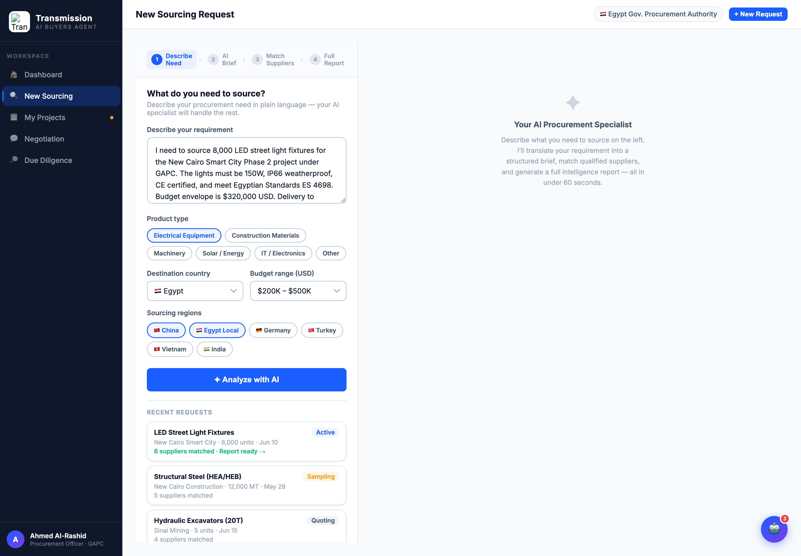
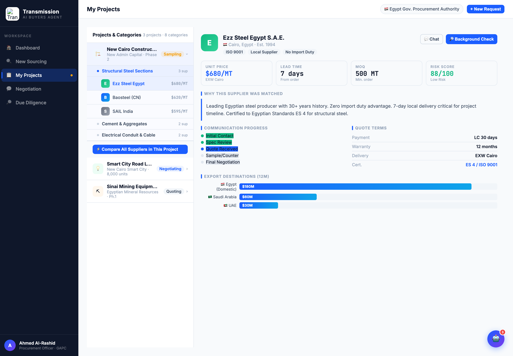
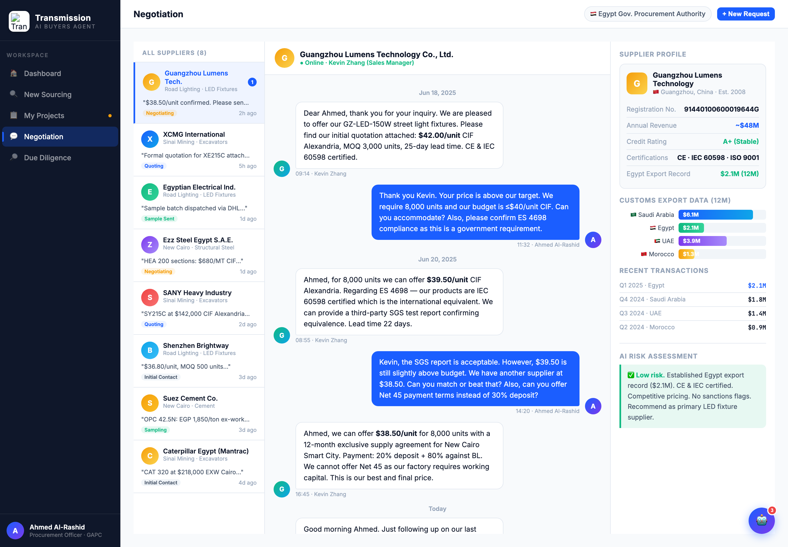
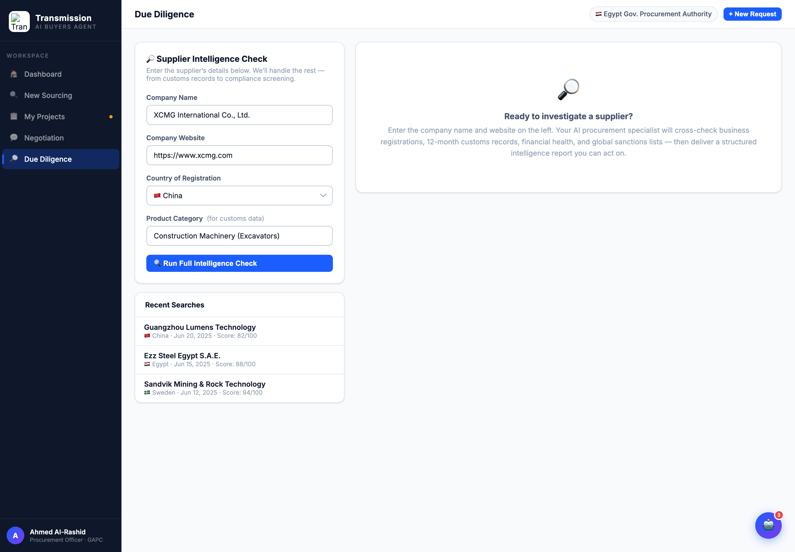

# Round 002 · 🟥 审计 · 逐视图深度审计(5 视图 + 动态行为登记 + 操作步数)

- **时间**:2026-06-25
- **档位**:🟥 审计轮(产出审计、补全 BACKLOG,**不改代码**)
- **backlog 来源**:大件「逐视图深度审计」

## 动态行为登记(真推进 vs 假转圈)
| 函数 (行) | 触发 | 行为 | 判定 |
|---|---|---|---|
| `runSupplierMatching` (2265) | 寻源 Match 步 | 5 步 active→done,每步真出结果行(847 家→9 家排名)再渲染供应商卡 | **真出结果 ✓**;但 ~15s 偏慢 |
| `openBgCheck` (2488) | 尽调/采购 Background Check | 4 步 active→done → 真结构化报告(注册/海关/财务/合规) | **真出结果 ✓**;~12s 偏慢 |
| `runDueDiligence` (2881) | 尽调 Run | 分步 → 报告 | 真出结果 ✓ |
| `openCompare` (2569) | 采购 Compare Suppliers | **`setInterval` 进度条 0→100% 空跑 ~6.7s** → 揭示静态 CMP_DATA | **🟥 假进度条红线** |
| `sendMsg` (2612) | 谈判输入框 | 买方打字气泡 → typing dots → 供应商罐头自动回复 | 买方亲自谈,违北极星 |
| `runSrcAnalysis` (2252) | 寻源 Analyze | 1.2s 后显示 brief | 轻量,尚可 |

## 各视图「买方必须亲自做的操作步数」 + 问题
- **dashboard**:被动信息墙;买方需自己读 + 「Click to reply」回复供应商。无助理在场。
- **sourcing**:≥5 步劳作(填 textarea + 选 product-type + country + budget + regions)再 Analyze = 逼买方填长表单。右栏 "AI Specialist" 占位是对的方向但空置。
- **procurement**:基础较好(助理已匹配 + 理由 + 进度 + quote terms);缺"助理在盯 + 需决策项"包装;Compare 走假进度条。
- **negotiation**:买方 Ahmed **亲自打字**与供应商聊 = 核心违规(应助理代谈)。供应商彩色头像撞色。
- **diligence**:又一张表单(Company/Website/Country/Category)再 Run = 逼买方劳作;助理应主动跑、买方只看结论 + 红旗。

## 跨视图确认
- R001 logo 白 chip + TM monogram 在全部 5 视图侧栏正常显示 ✓(回归抽查通过)。

## 验收
- 审计轮,未改代码 → console 无新增风险;无回归。北极星自检完成,findings 已写回 BACKLOG(新增红线区 4 项 + 提速项 + 校准去 AI 味项)。

## 截图
   

## 落库
- 非 git 仓库 → 写报告 + 更新 INDEX / LOOP-STATE / BACKLOG。
