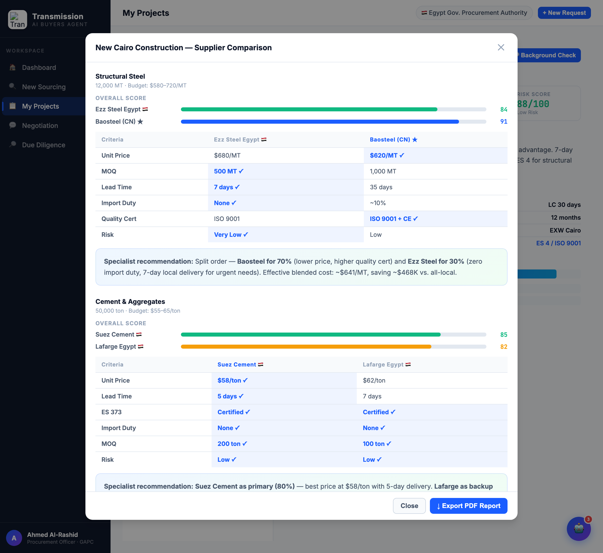
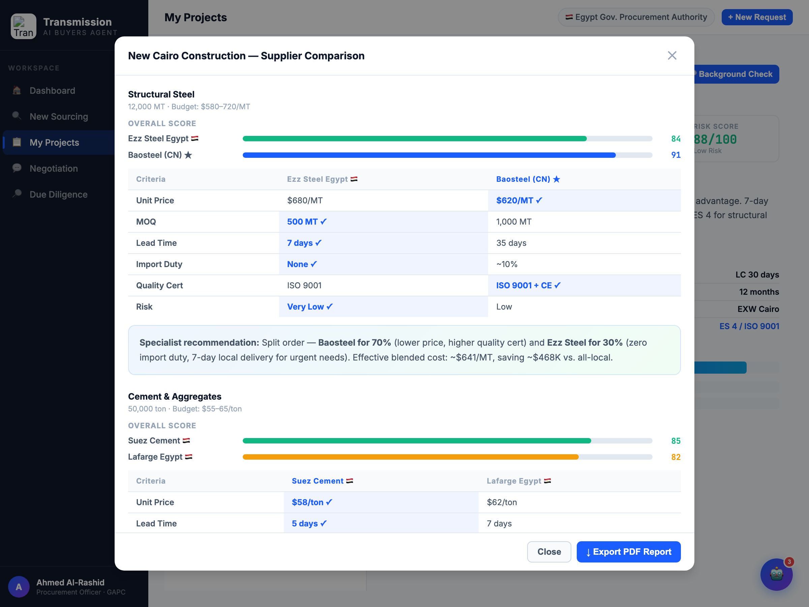

# Round 003 · 🟦 Standard · 修 openCompare 假进度条(红线)

- **时间**:2026-06-25
- **档位**:🟦 Standard
- **backlog 来源**:红线区「[RED] 修 openCompare 假进度条」(R002 审计发现)

## 做了什么
1. **删假进度条**:`openCompare`(L2569)原用 `setInterval` 每 80ms +1.2% 把进度条空跑到 100%(~6.7s)再揭示**静态** CMP_DATA 报告 = 假进度条红线。删除 `cmp-progress-bar` 及整段 setInterval。
2. **换成诚实的"已对比完成"**:loading 块改为标题「Comparison ready」+ 一句"专家已就 4 个维度比好"+ 4 个**真实对比维度**(Unit price & blended cost / Quality & certifications / Compliance & import duty / Supply risk & lead time)的 checklist,每条带绿 ✓,<1s 快速逐条 reveal(120+i*140ms)后 `showCmpReport`。维度均为报告里**真实存在**的对比项,非凭空数字 → 属允许的"分阶段交付真出结果",非假转圈。
3. **去 emoji**:删 loading 的 📊;报告里 `🤖 AI Recommendation:` → `Specialist recommendation:`。

## 验收
- **console 零错**:headless 执行 `openCompare('construction')` 无 stderr 报错;报告成功渲染(若抛错则报告不会出) ✓
- **动态行为点通**:checklist reveal → 报告揭示,跑通 ✓
- **跨视图抽查**:procurement 视图在 modal 后正常;无 `cmp-progress` 残留引用(grep 0) ✓
- **3 critic 两轴**:
  - 【产品:零负担 / 真人感(真实挣来)】**KEEP** — 消除假进度条红线;"助理已替你比好"框架更贴零负担 + 真实人感。
  - 【视觉:高级 / 零 AI 味】**KEEP** — 去 📊 / 🤖 emoji;干净 checklist + 报告,无凭空百分比。
  - 【正确性 / 对比度】**KEEP** — 绿 ✓ chip 清晰,报告表格完好。
  - 裁决:**3/3 KEEP ✓**

## 截图

## 残留 → backlog
- sourcing/bg-check 分阶段 loader 仍偏慢(真出结果,非红线)→ BACKLOG Standard 提速项。
- 谈判买方亲自谈 / sourcing+diligence 长表单 / 助理常驻骨架 等大件未动。

## 落库
- 非 git 仓库 → 写报告 + 更新 INDEX / LOOP-STATE / BACKLOG。
