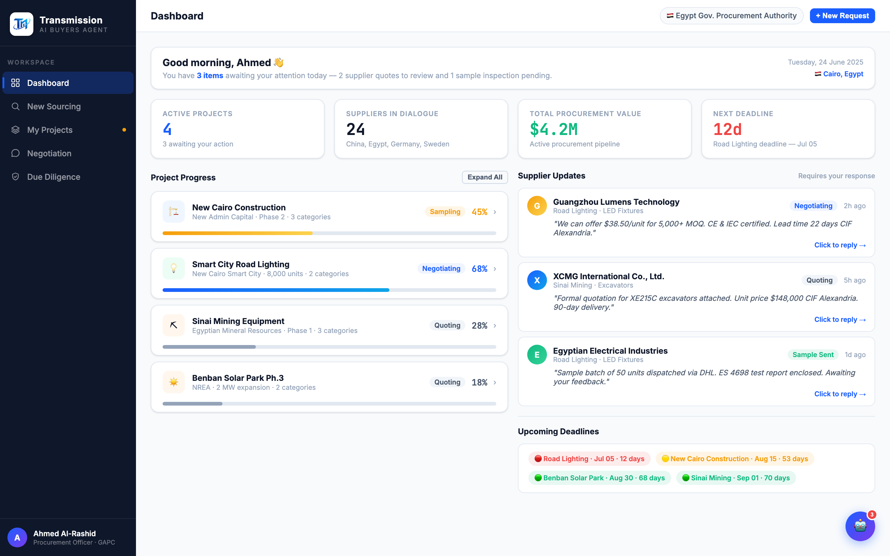

# Round 004 · ⬜ Utility · nav emoji → SVG 线性图标(去 AI 味)

- **时间**:2026-06-25
- **档位**:⬜ Utility
- **backlog 来源**:去 AI 味「nav emoji 图标」

## 做了什么
1. `.nav-icon` CSS:从 `text-align:center;font-size:14px`(emoji 容器)→ flex-center 18px;新增 `.nav-icon svg{16px;stroke:currentColor;fill:none;stroke-width:1.8;round caps}`。
2. 5 个侧栏 nav 的 emoji 换 inline SVG 线性图标:Dashboard 🏠→grid(4 方块)· New Sourcing 🔍→search(放大镜)· My Projects 📋→layers(叠层)· Negotiation 💬→chat bubble · Due Diligence 🔎→shield-check(盾+勾)。`stroke:currentColor` 继承 nav-item 颜色,active=白、默认=半透明灰,随状态自然变色。

## 验收
- **console 零错**:headless 加载无 stderr ✓
- **动态行为**:`showView` onclick 未动,active 态(白图标)+ hover 正常 ✓
- **跨视图抽查**:侧栏共用,图标在全部视图显示;active tint 跟随当前视图 ✓
- **3 critic 两轴**:
  - 【视觉:零 AI 味 / 高级】**KEEP** — 去 5 个 emoji,统一克制线性图标集,随状态 tint = 高端 B2B 终端质感。
  - 【产品:零负担 / 人感】**KEEP**(中性)— 无负担变化,导航更专业可信。
  - 【对比度 / 清晰度】**KEEP** — navy 上线性图标清晰,active 白图标突出。
  - 裁决:**3/3 KEEP ✓**

## 截图

## 残留 → backlog
- `👋` / org-badge `🇪🇬` / `Cairo 🇪🇬` / diligence `🔧` / robot-btn `🤖` / 供应商卡 emoji logo / 彩色撞色头像 仍待去 AI 味(分项处理)。

## 落库
- 非 git 仓库 → 写报告 + 更新 INDEX / LOOP-STATE / BACKLOG。
