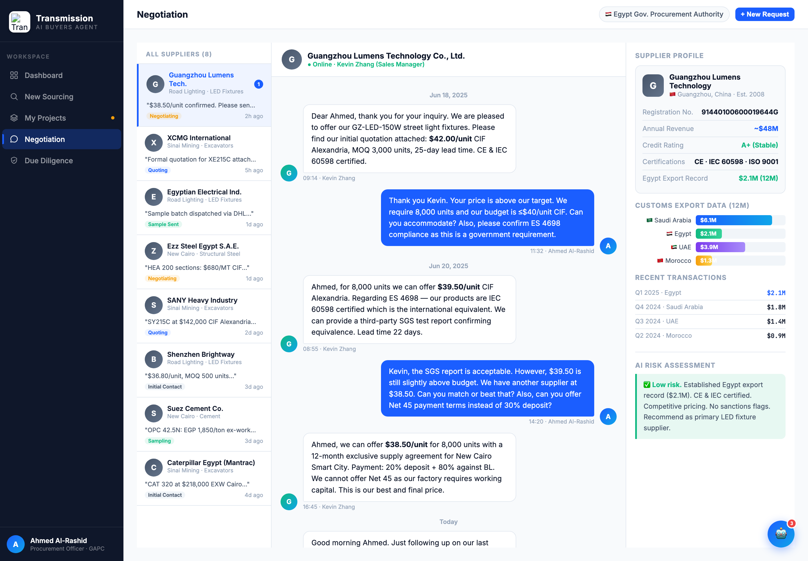
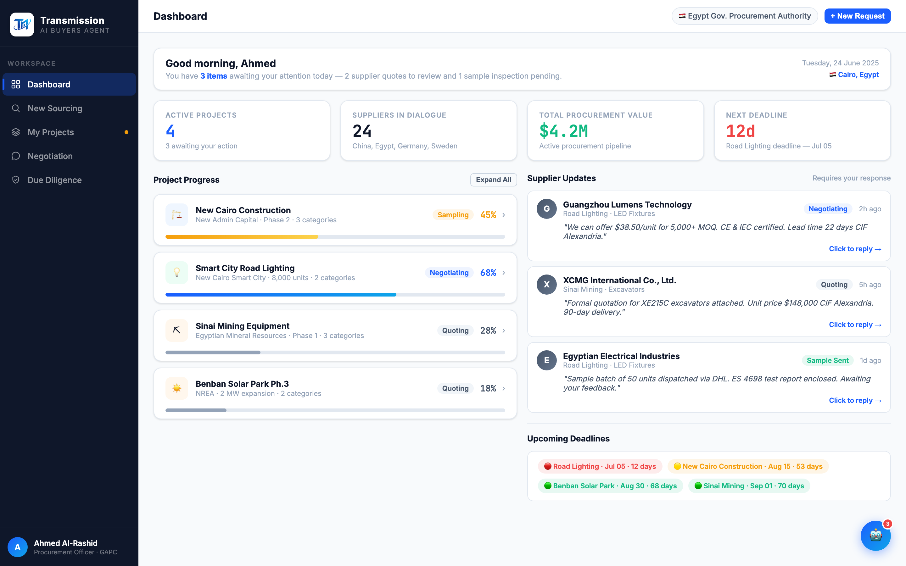

# Round 005 · ⬜ Utility · 头像撞色统一(两档) + 去装饰 emoji

- **时间**:2026-06-25
- **档位**:⬜ Utility(机械批量替换 + 肉眼过)
- **backlog 来源**:去 AI 味「彩色字母 avatar 撞色」+「flag / 装饰 emoji」(部分)

## 做了什么
1. **审计确认**:7 种头像渐变(amber #F59E0B×2、green #10B981、purple #7C3AED、red #EF4444、cyan #0EA5E9-38、supplier-blue #1B5EFF-0EA5E9)经 grep 全部仅用于头像/圆形元素(`*-ava` 类 / 圆形 div / SUPPLIERS.color / NEG_DATA.avaColor / robot FAB),**无一用于语义进度条或 badge** → 批量替换安全。
2. **两档统一**(sed,顺序避免二次转换:先把 supplier-blue→slate,最后 self-purple→brand-blue):
   - **self**(user-ava / msg-ava.buyer / robot FAB)= 品牌蓝 `#1B5EFF,#0EA5E9`(3 处)。
   - **supplier / contact** = 中性 slate `#475569,#64748B`(66 处)。
   - 结果:彩虹撞色头像海 → 干净「蓝=你,slate=供应商」两档层级。
3. **去装饰 emoji**:`Good morning, Ahmed 👋`→去 👋;`🤖 YOUR PROCUREMENT SPECIALIST SUGGESTS`、`🤖 AI Procurement Recommendation`→去 🤖。

## 验收
- **console 零错**:negotiation + dashboard headless 均无 stderr ✓
- **动态行为**:`selectNegSupplier`/`buildBriefing` 仍从 data 取 avaColor(现为 slate)正常;头像纯样式 ✓
- **跨视图抽查**:dashboard(Supplier Updates G/X/E slate、buyer A 蓝、FAB 蓝、👋 已去)+ negotiation(供应商列表/聊天 slate、buyer 蓝)均正常;其余视图共用同类/数据,一致 ✓
- **3 critic 两轴**:
  - 【视觉:零 AI 味 / 高级】**KEEP** — 消除彩虹头像撞色(AI 味大源)+ 去 3 处装饰 emoji,中性 slate 高级。
  - 【产品:零负担 / 人感】**KEEP** — 「蓝=你 / slate=供应商」层级更清晰。
  - 【对比度】**KEEP** — 白字初始母在 slate / 蓝上均清晰。
  - 裁决:**3/3 KEEP ✓**

## 截图

## 残留 → backlog
- negotiation 右栏 export 条仍 blue/green/purple/amber 撞色(新增 backlog 项)。
- robot FAB `🤖` + robot-panel `🤖` 归助理常驻大件一起做;`🔧`/flag/`📊`/`🏗`/供应商卡 emoji logo 待去。

## 落库
- 非 git 仓库 → 写报告 + 更新 INDEX / LOOP-STATE / BACKLOG。备份 `/tmp/r005-backup.html`。
