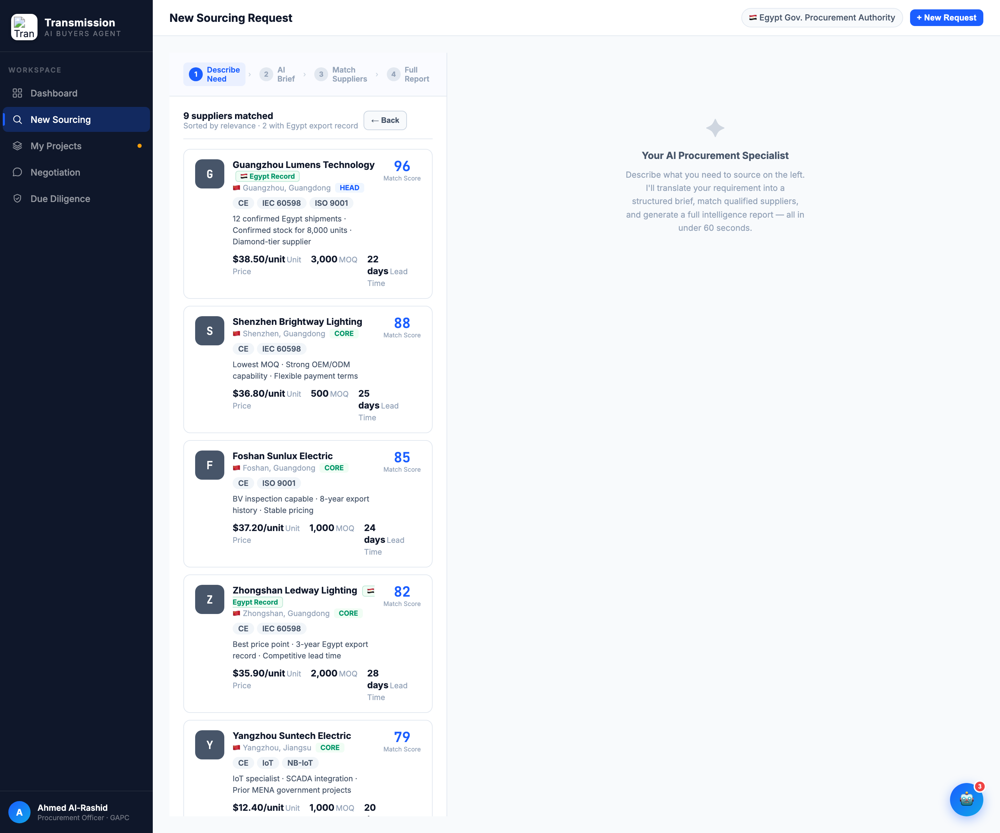

# Round 006 · ⬜ Utility · 供应商卡 emoji logo → slate 首字母 mono chip

- **时间**:2026-06-25
- **档位**:⬜ Utility
- **backlog 来源**:去 AI 味「供应商卡 emoji『logo』」

## 做了什么
1. `.smc-logo` CSS:浅底带边框 emoji 容器 → slate `#475569` chip + 白色 700 `JetBrains Mono` 16px(与 R005「supplier=slate」头像体系一致)。
2. `renderSupplierCards`:`
${s.logo}
` → `${s.name.charAt(0)}`,9 张供应商卡的 emoji(💡🔆☀️💫📡⚡🌟💎🏆)全部变为首字母(G/S/F/Z/Y/E/D/P/O)。`MATCH_SUPPLIERS` 的 `logo:` 字段保留但不再渲染(零风险,不删避免改数组结构)。

## 验收
- **console 零错**:headless 渲染 9 卡无 stderr ✓
- **动态行为**:`renderSupplierCards` 正常输出首字母 chip ✓
- **跨视图抽查**:`.smc-logo` 仅用于 sourcing 匹配卡,其它视图无影响 ✓
- **3 critic 两轴**:
  - 【视觉:零 AI 味 / 高级】**KEEP** — 去 9 个 emoji,slate mono 首字母 chip 专业一致。
  - 【产品:零负担】**KEEP**(中性)。
  - 【对比度】**KEEP** — 白字 slate 清晰。
  - 裁决:**3/3 KEEP ✓**

## 截图

## 残留 → backlog
- sourcing 右栏 `src-right-empty` 的 ✦ sparkle 装饰图标(新增项);供应商 Egypt Record / 各处 flag emoji;robot FAB/panel 🤖;`🔧`/`🏗`/`📊`;negotiation export 条撞色。

## 落库
- 非 git 仓库 → 写报告 + 更新 INDEX / LOOP-STATE / BACKLOG。
