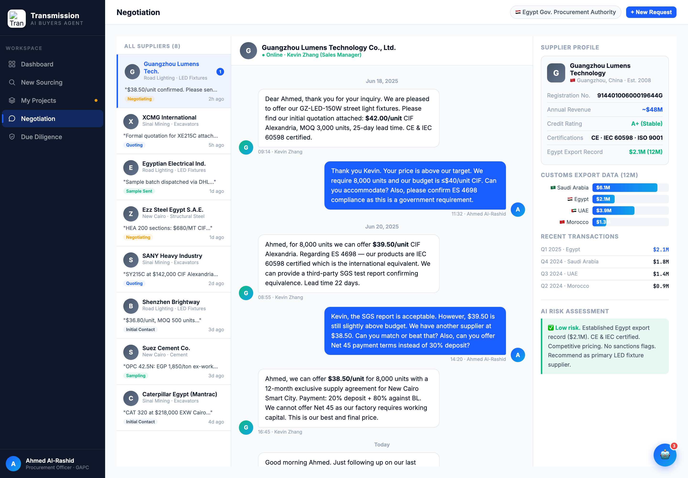

# Round 007 · ⬜ Utility · export/destination 条撞色 → 统一品牌蓝

- **时间**:2026-06-25
- **档位**:⬜ Utility
- **backlog 来源**:去 AI 味「negotiation 右栏 export 条撞色」

## 做了什么
export / destination 横条原按国家用 blue/green/purple/amber/grey 撞色。统一为品牌蓝 `linear-gradient(90deg,var(--accent),var(--accent2))`,改 3 处渲染路径:
1. **negotiation 静态 markup**(右栏「CUSTOMS EXPORT DATA」):L1781(green→accent)、L1787(purple→accent)、L1793(amber→accent)。
2. **diligence dd-bar**(export destinations,带 data-w 动画):L1974(purple)、L1978(green)、L1982(amber)、L1986(grey)→ accent。
3. **JS `selectNegSupplier` exBars**(L2847):`${e.c},${e.c}88` → `var(--accent),var(--accent2)`(NEG_DATA `c:` 字段保留但不再用)。
- procurement `buildBriefing` exBars(L2416)本就是单一蓝,无需改。

## 验收
- **console 零错**:negotiation headless 无 stderr ✓
- **未误伤语义色**:`.prog-green`(L94)/`.prog-amber`(L95)CSS 工具类完好;Low-risk 绿框、状态 badge(Sample Sent / Negotiating)语义色保留 ✓
- **无残留**:grep `chart-bar-h-fill` 中 green/purple/amber/#6B7280 = 0 ✓
- **动态行为**:dd-bar 仍按 data-w 动画(仅改色不影响宽度);selectNegSupplier 切供应商 exBars 蓝 ✓
- **3 critic 两轴**:
  - 【视觉:零 AI 味 / 高级】**KEEP** — export 条彩虹撞色 → 单一品牌蓝,信息靠宽度/标签区分,克制专业。
  - 【产品:零负担】**KEEP**(中性)。
  - 【对比度】**KEEP**。
  - 裁决:**3/3 KEEP ✓**

## 截图

## 残留 → backlog
- robot FAB/panel 🤖(助理大件)、`🔧`/`🏗`/`📊`、sourcing ✦ sparkle、各处 flag emoji。
- 大件(助理常驻 / dashboard 三段 / 谈判代谈)待 review。

## 落库
- 非 git 仓库 → 写报告 + 更新 INDEX / LOOP-STATE / BACKLOG。
