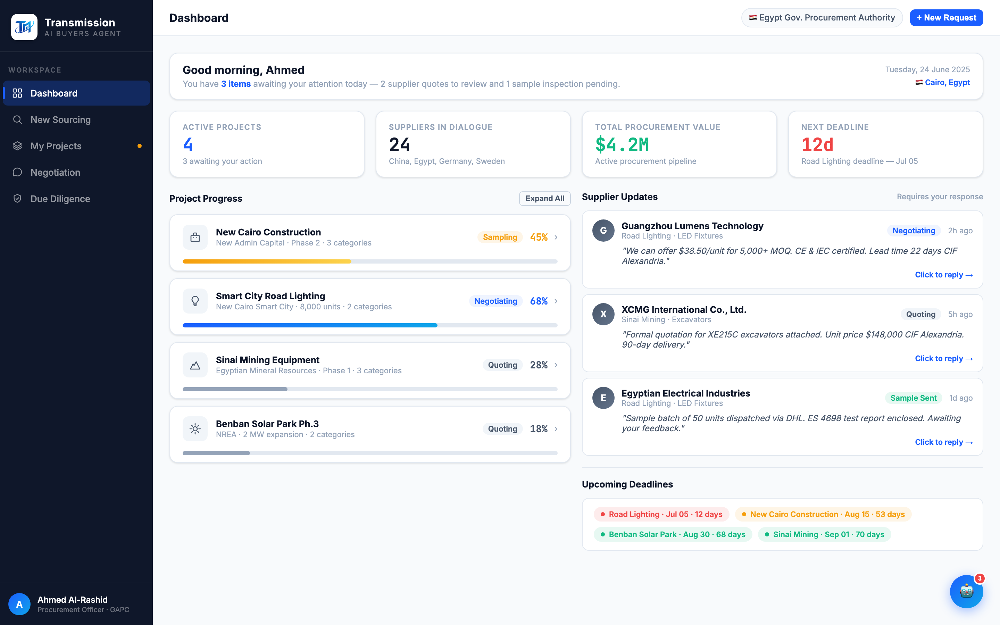

# Round 008 · ⬜ Utility · dashboard 去 emoji(项目图标 + 截止圆点)

- **时间**:2026-06-25
- **档位**:⬜ Utility
- **backlog 来源**:去 AI 味「proj-ph-icon emoji」+ 截止状态圆点

## 做了什么
1. **proj-ph-icon**(dashboard Project Progress 4 个项目图标):🏗💡⛏☀️ → slate SVG 线性图标(building / bulb / mountain / sun);bg 从 4 种 pastel 撞色(#EFF6FF/#ECFDF5/#FFF7ED×2)统一为中性 `#F1F5F9`;新增 `.proj-ph-icon svg{stroke:#475569;...}`。
2. **Upcoming Deadlines 圆点**:🔴🟡🟢 emoji → `` CSS 圆点,`background:currentColor` 自动取 pill 的语义色(red/amber/green),新增 `.dl-dot`。pill 本就带语义底色,emoji 圆圈冗余且跨平台渲染不一,改 CSS 点更克制锐利。

## 验收
- **console 零错**:dashboard headless 无 stderr ✓
- **动态行为**:纯静态视觉,未触 JS ✓
- **跨视图抽查**:proj-ph-icon / dl-item 仅 dashboard 用,其它视图无影响 ✓
- **3 critic 两轴**:
  - 【视觉:零 AI 味 / 高级】**KEEP** — 去 8 个 emoji + pastel 撞色底 → 统一中性 chip + slate 线性图标 + 精准 CSS 状态点。
  - 【产品:零负担】**KEEP**(中性)。
  - 【对比度】**KEEP** — slate 图标 / 语义色点清晰。
  - 裁决:**3/3 KEEP ✓**

## 截图

## 残留 → backlog
- sourcing 流程内大批 emoji(pcb-icon / rec-chip / sr-cluster / 按钮 ✦📄 / 📊 / 📌 / diligence 🔎)→ 留一轮集中做。
- flag emoji(功能性,低优先,待定)。robot FAB/panel 🤖 归助理大件。

## 落库
- 非 git 仓库 → 写报告 + 更新 INDEX / LOOP-STATE / BACKLOG。
