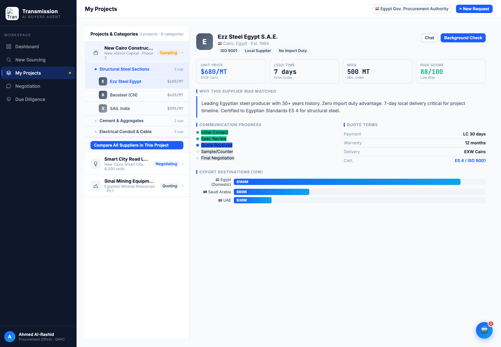
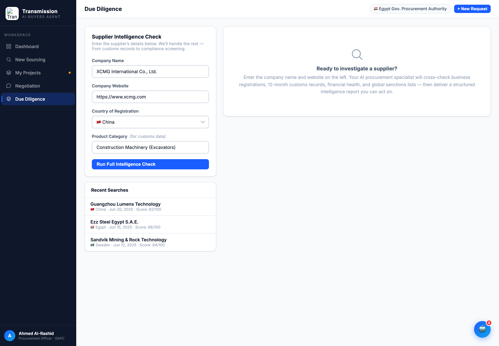

# Round 009 · ⬜ Utility · 去 AI 味 emoji 全量收尾(sourcing / procurement / diligence / 模态)

- **时间**:2026-06-25
- **档位**:⬜ Utility(批量;Python 带断言替换 + Edit CSS)
- **backlog 来源**:去 AI 味「sourcing 流程内 emoji」+ 顺势清 procurement/diligence/模态

## 做了什么(共 ~34 处)
- **sourcing**:pcb-icon 📋⭐🎯🗺️ → clipboard/star/target/pin SVG + 中性 chip;sr-cluster-icon 🏭⚡🌍(×2)→ factory/bolt/globe SVG;sr-callout 📌💡 去;rec-chip ✅🏭📦⚠️🔬 去;按钮 ✦📄 去;report 📊 → bar-chart SVG;src-empty ✦ → search SVG。
- **procurement**:proj-row-icon 🏗💡⛏ → building/bulb/mountain SVG + 中性 chip;⚡ Compare 按钮(×3)去;👆 占位 → cursor SVG;buildBriefing 💬Chat / 🔎Background Check 按钮去 emoji;📦 Customs 标题去。
- **diligence**:标题 🔎 去;🔍 Run 按钮去;✅ Low risk 去;🔎 占位 → search SVG。
- **模态**:contact-modal 🤝 → check-circle SVG;✅ 已联系文案 + showToast ✅ 去。
- 新增 CSS:`.pcb-icon svg` / `.sr-cluster-icon svg` / `.src-empty-icon svg` / `.proj-row-icon svg`(统一 slate `#475569` 线性,中性 `#F1F5F9` chip)。

## 验收
- **console 零错**:procurement + diligence headless 无 stderr ✓
- **全量 emoji sweep**:grep 全文除功能性国旗 / ✓ / ✕ / 助理 🤖(大件)/ 死 `logo:` 数据外,**0 装饰 emoji** ✓
- **动态行为**:buildBriefing 按钮 / renderSupplierCards / contact modal / toast 仍正常(模板字符串内替换,无语法断裂,渲染正常)✓
- **跨视图抽查**:dashboard(R008)/sourcing/procurement/diligence/negotiation 全部已清并截图 ✓
- **3 critic 两轴**:
  - 【视觉:零 AI 味 / 高级】**KEEP** — 全应用消除装饰 emoji,统一 slate SVG 线性图标系 + 中性 chip,真正像高端 B2B 采购终端。
  - 【产品:零负担】**KEEP**(中性)。
  - 【对比度】**KEEP**。
  - 裁决:**3/3 KEEP ✓**

## 截图

## 残留 → backlog
- flag emoji(功能性,低优先,待定)。
- **去 AI 味基本完成 → 剩余高价值全在大件**:助理常驻骨架(含 robot FAB/panel 🤖)/ dashboard 三段 / 谈判代谈 / sourcing+diligence 表单→预填。下一轮起按「人感骨架优先」推进大件,**做完暂停 review**。

## 落库
- 非 git 仓库 → 写报告 + 更新 INDEX / LOOP-STATE / BACKLOG。备份 /tmp/r009-backup.html。
