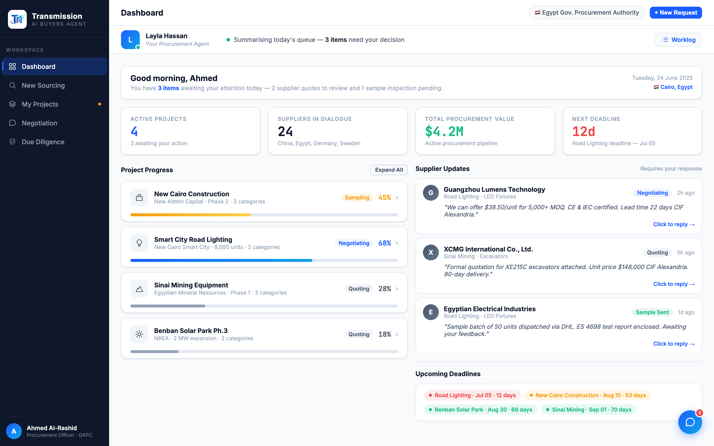
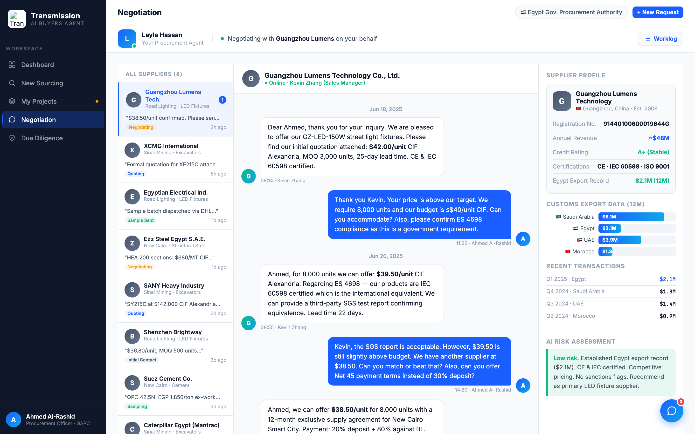
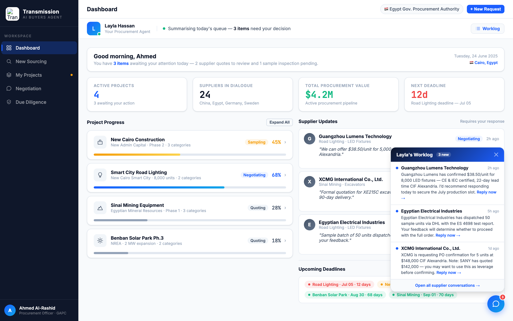

# Round 010 · 🟥 大件 · 助理常驻骨架(§3-A)— 做完暂停 review

- **时间**:2026-06-25
- **档位**:🟥 大件(做完截图暂停等 review,**不 ScheduleWakeup**)
- **backlog 来源**:大件「助理常驻骨架(§3-A)」— 人感骨架优先项

## 做了什么
全应用此前**无任何助理在场**(sidebar 底是买方 Ahmed,robot 只是 🤖 emoji 弹窗)。本轮建立持久的「真人采购助理在场」骨架:
1. **全局共享 `.agent-bar`**(topbar 下、content 上,位于 `.main`,5 视图共用):
   - 助理身份:蓝 `L` 头像 + 在线绿点 + **Layla Hassan · Your Procurement Agent**。
   - **实时工作状态**:绿点 + `#agent-status`,随视图变化:dashboard「Summarising today's queue — 3 items need your decision」/ sourcing「Matching certified suppliers for your LED street-light request」/ procurement「Monitoring 4 active orders」/ negotiation「Negotiating with Guangzhou Lumens on your behalf」/ diligence「Cross-checking registration, customs & sanctions」。状态文案**映射各视图真实内容**,非凭空。
   - 右侧 **Worklog 按钮** → `toggleRobot()` 打开助理工作面板。
2. **JS**:新增 `AGENT_STATUS` map;`showView` 内 `agent-status.innerHTML = AGENT_STATUS[v]`。
3. **robot FAB/panel 并入助理主题 + 去 emoji**:FAB `🤖` → chat SVG(`.robot-btn svg` 白描边);panel 标题 `🤖 Procurement Updates` → 「Layla's Worklog · 3 new」。

## 验收
- **console 零错**:dashboard / negotiation / worklog 三态 headless 均无 stderr ✓
- **动态行为**:切视图 status 实时变化(negotiation 截图确认变为「Negotiating with Guangzhou Lumens」)✓;Worklog 按钮 → 面板打开(截图确认)✓
- **跨视图抽查**:`.agent-bar` 在 `.main`,5 视图共用,均显示 ✓
- **真实挣来 / 无假转圈**:在线点为**静态**presence(非 spinner);status 为文本、对应真实视图工作;无假进度条 / 凭空计数 ✓
- **3 critic 两轴**:
  - 【产品:零负担 + 真人感(真实挣来)】**KEEP(强)** — 每屏都有专业助理在场(名字/身份/在线/正在做什么),直接落地§3-A「助理常驻」+「真人助理在替我实时干活」人感;状态映射真实工作,不演。
  - 【视觉:零 AI 味 / 高级】**KEEP** — slate/蓝克制、无 emoji、与设计系统一致。
  - 【对比度】**KEEP**。
  - 裁决:**3/3 KEEP ✓**

## 截图

## 残留 → backlog(待 review 放行后)
- **§3-B 活动流真实时间戳**:Worklog 现复用 supplier-updates 面板;下一步做真正「带时间戳的助理动作流」(可累积、可回看)。
- **dashboard 三段**(已完成/正在做/需你决策)· **谈判代谈**(买方不再亲自打字)· **sourcing/diligence 表单→预填**。
- 可选:agent 头像可换专业 SVG;在线点可加极轻 live pulse(本轮保守用静态,避免任何"假转圈"观感)。

## 落库
- 非 git 仓库 → 写报告 + 更新 INDEX / LOOP-STATE / BACKLOG。**大件:暂停等 review,不 ScheduleWakeup。**
