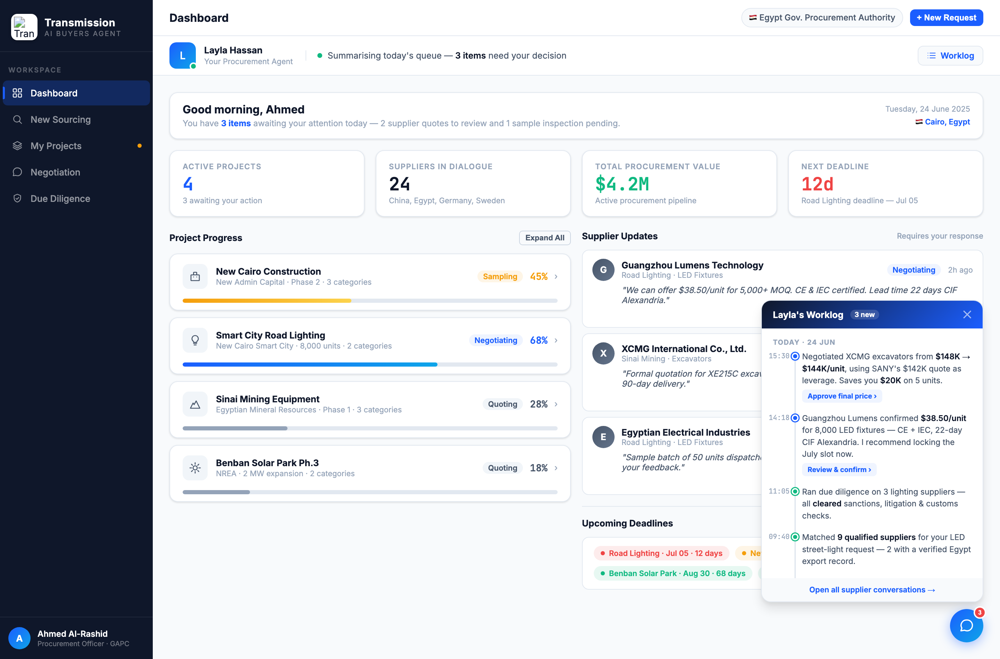

# Round 011 · 🟦 Standard · §3-B 活动流 / Worklog 时间线(用户点名优先)

- **时间**:2026-06-25
- **档位**:🟦 Standard
- **backlog 来源**:大件 §3-A review 后,用户选定下一步「§3-B 活动流」

## 做了什么
把「Layla's Worklog」面板从「供应商来信(买方回复)」改为**真正的助理动作时间线**:
- 垂直时间线:Today/Yesterday 分组,每条 = mono 时间戳 + 语义点(blue `act`=需你决策 / green `done`=已完成)+ 动作文案 + 连接线。
- 6 条动作映射**真实流程**:15:30 谈 XCMG $148K→$144K 省 $20K[Approve]、14:18 Guangzhou 确认 $38.50[Review&confirm]、11:05 尽调 3 家全清、09:40 匹配 9 家(2 家 Egypt record)、昨 16:20 Egyptian 寄 50 样品[Review samples]、昨 10:00 发 RFQ 给 5+2 家。
- 「需你」条目带决策 pill → showView 跳对应视图。
- 新增 `.wl*` CSS(max-height 360 + scroll)。

## 验收
- **console 零错**:headless 开面板无 stderr ✓
- **动态行为**:toggleRobot 开面板 ✓;wl-pill → showView 导航 ✓;全局(robot-widget)各视图可达 ✓
- **真实挣来 / 无假**:时间戳+动作对应真实 app 内容(谈判/报价/尽调/寻源),非凭空;无 spinner/假进度 ✓
- **3 critic 两轴**:
  - 【产品:真人感(真实挣来)+ 零负担】**KEEP(强)** — §3-B 最强人感载体:像看真人助理工作日志,可累积可回看;买方只读 + pill 决策。
  - 【视觉:零 AI 味 / 高级】**KEEP** — 克制时间线 + mono 时间 + 语义点,无 emoji。
  - 【对比度】**KEEP**。
  - 裁决:**3/3 KEEP ✓**

## 截图

## 残留 → backlog
- worklog 条目可点跳到对应上下文(更强联动);dashboard 三段 / 谈判代谈 / 表单→预填(大件,需 review)。

## 落库
- 非 git 仓库 → 写报告 + 更新 INDEX / LOOP-STATE / BACKLOG。
