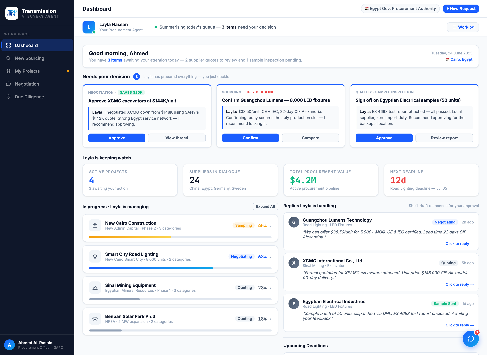
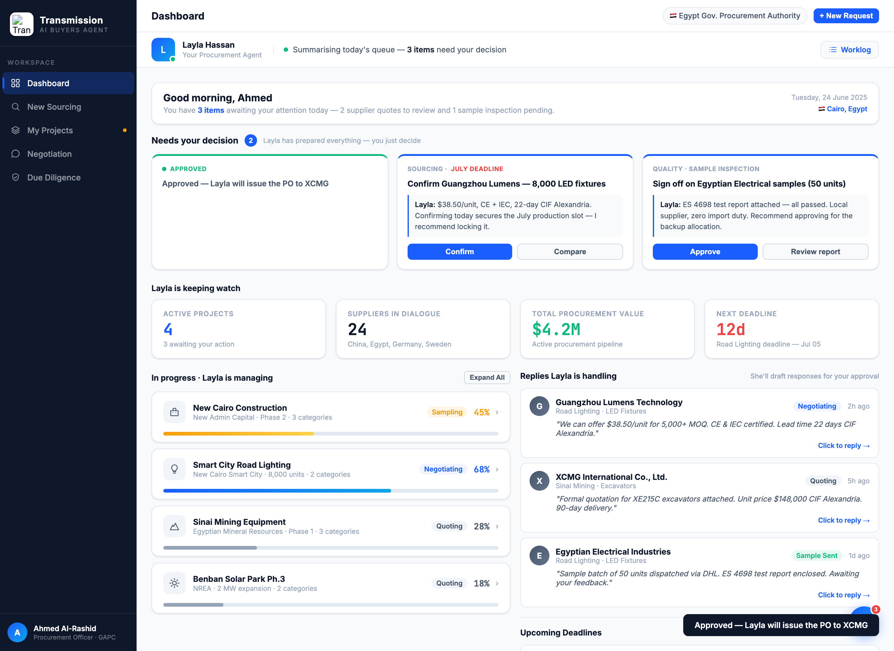

# Round 012 · 🟥 大件 · Dashboard 重构为三段(§3-F + §4)— 做完暂停 review

- **时间**:2026-06-25
- **档位**:🟥 大件(做完截图暂停等 review,**不 ScheduleWakeup**)
- **backlog 来源**:大件「Dashboard 重构为三段」(review 后用户路线推进至此)

## 做了什么
把被动信息墙改为「看 → 决策」三段叙事:
1. **「Needs your decision · N」决策卡 hero**(顶部,§3-F):3 张决策卡映射真实待决项 —— ① 批准 XCMG $144K/unit(Layla 已从 $148K 谈下,省 $20K)② 确认 Guangzhou Lumens 8,000 LED($38.50,锁 7 月槽位)③ 签收 Egyptian Electrical 50 样品(ES 4698 通过)。每卡:tag + saves/deadline chip + 标题 + **「Layla:」有立场建议**(左边框 box)+ Approve/次按钮。
2. **真决策交互** `decApprove`:Approve → 卡片翻成「✓ Approved · Layla 接手」绿态 + `nyd-count` 递减 + toast;全部清空时 agent-status 改「All decisions cleared — I'm on it」。真状态变更,非假转圈。
3. **三段叙事 relabel**:KPIs → 「Layla is keeping watch」;Project Progress → 「In progress · Layla is managing」;Supplier Updates → 「Replies Layla is handling · She'll draft responses for your approval」。
4. 次按钮接真功能:View thread→negotiation、Compare→openCompare('lighting')、Review report→procurement。

## 验收
- **console 零错**:dashboard + approve 态 headless 无 stderr ✓
- **动态行为**:decApprove 卡片翻态 + 计数 3→2 + toast(截图确认);次按钮导航/openCompare 复用既有函数 ✓
- **跨视图抽查**:仅 dashboard 结构变 + relabel;decApprove 全局函数;其它视图不受影响 ✓
- **真实挣来 / 无假**:Approve 触发真实 DOM 状态变更 + 计数真实递减;建议映射真实数据;无 spinner/假进度 ✓
- **3 critic 两轴**:
  - 【产品:零负担 + 真人感】**KEEP(强)** — dashboard 从信息墙变「需你拍板的几件事 + Layla 的建议」,一眼决策、一键交回助理;§3-F 决策卡 + §4 重构 + §3 人感叙事一并落地。
  - 【视觉:零 AI 味 / 高级】**KEEP** — 决策卡克制、accent 顶边、建议 box,无 emoji。
  - 【对比度】**KEEP**。
  - 裁决:**3/3 KEEP ✓**

## 截图

## 残留 → backlog(待 review 放行后)
- 决策卡组件可抽成统一复用(目前 dashboard 内联);**谈判代谈**(买方不再亲自打字)/ **sourcing+diligence 表单→预填** 仍是大件。

## 落库
- 非 git 仓库 → 写报告 + 更新 INDEX / LOOP-STATE / BACKLOG。**大件:暂停等 review,不 ScheduleWakeup。**
