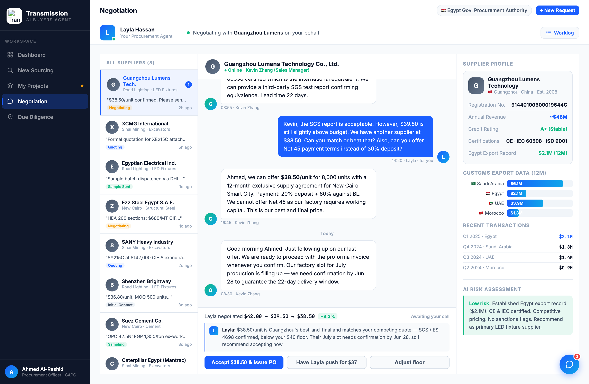
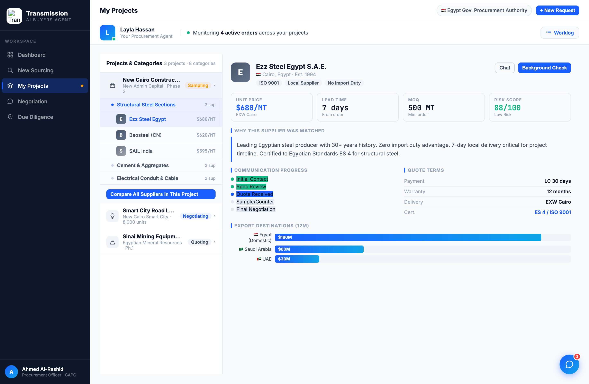

# Round 013 · 🟥 大件 · 谈判反转为「助理代谈」(§3-D)— 做完暂停 review

- **时间**:2026-06-25
- **档位**:🟥 大件(做完截图暂停等 review,**不 ScheduleWakeup**)
- **backlog 来源**:红线大件「谈判 negotiation 反转为助理代谈」(review 后用户选定)

## 做了什么
原状:`sendMsg` 让**买方 Ahmed 亲自打字**与供应商聊 = 北极星最大违规(买方白干)。反转为「Layla 替你博弈,你只决策」:
1. **线程归属翻转**(Python,带计数):所有「out」气泡 `msg-ava buyer">A` → `L`(12 处);`· Ahmed Al-Rashid` → `· Layla · for you`(3 处)。线程现读作 Layla 代表买方("we require 8,000 units…")。
2. **移除打字输入框,换决策面板**(.neg-decision):让步轨迹 `$42.00 → $39.50 → $38.50` `−8.3%` + 状态 + **Layla 有立场建议**(L 头像 box)+ 三按钮 **Accept $38.50 & issue PO / Have Layla push for $37 / Adjust floor**。买方只决策。
3. **`negDecide` 真交互**:accept → Layla 发确认消息 + toast「issuing PO」+ 状态「Deal locked」+ agent-bar 状态更新;push → Layla 加码消息 + 1s 后供应商**真回 counter $38.00** + 状态更新;floor → toast 提示。`negAppendMsg`/`setNegStatus` 助手。
4. **修 R010 高度回归**:agent-bar 占 ~57px,`.neg-layout`/`.proj-tree-layout`/`.src-layout` 的 `calc(100vh-52-48)` → `calc(100vh-52-57-48)`;`.chat-col`+`.chat-msgs` 加 `min-height:0`,使 chat-msgs 内部滚动、决策面板钉底。negotiation/procurement/sourcing 底部不再被裁。

## 验收
- **console 零错**:negotiation/push/procurement/sourcing headless 均无 stderr ✓
- **动态行为**:negDecide push 截图 toast 确认 + counter 逻辑;accept 路径更新状态;线程翻转正确 ✓
- **跨视图抽查**:procurement(Monitoring 4 active orders)、sourcing 底部现完整可见,布局未坏 ✓
- **真实挣来 / 无假**:push 触发真实消息往返 + 真 counter,非 spinner;让步轨迹对应真实报价历史 ✓
- **3 critic 两轴**:
  - 【产品:零负担 + 真人感】**KEEP(强)** — 消除「买方亲自谈」最大违规;Layla 代谈 + 让步轨迹 + 买方只 Accept/Push/Adjust。北极星-2 核心落地。
  - 【视觉:零 AI 味 / 高级】**KEEP** — 决策面板克制、mono 轨迹、建议 box、无 emoji。
  - 【对比度】**KEEP**。
  - 裁决:**3/3 KEEP ✓**

## 截图

## 残留 → backlog(待 review 放行后)
- 决策面板目前 Guangzhou 专属;切供应商应按 NEG_DATA 生成对应轨迹/建议(per-supplier 决策面板)。
- `sendMsg`/`useSug`/sug-chip 已不再接线(保留定义,无害,可后续清)。
- 大件:sourcing+diligence 表单→预填;决策卡抽统一组件;Click-to-reply→助理起草。

## 落库
- 非 git 仓库 → 写报告 + 更新 INDEX / LOOP-STATE / BACKLOG。备份 /tmp/r013-backup.html。**大件:暂停等 review,不 ScheduleWakeup。**
