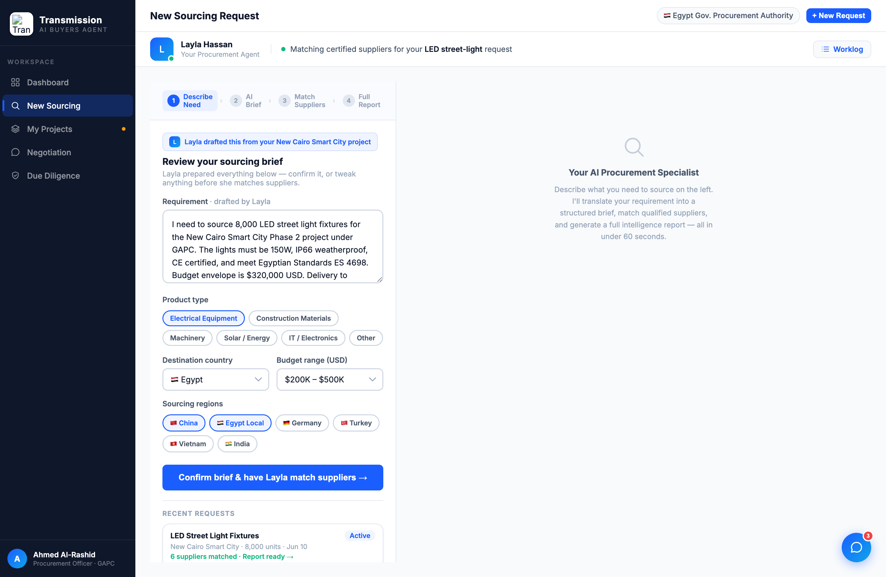
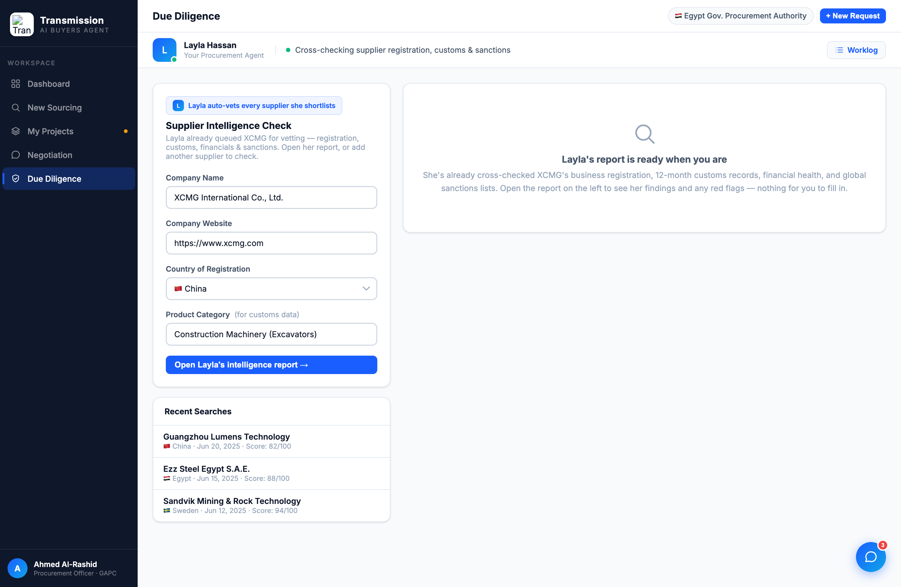

# Round 014 · 🟦/🟥 · sourcing + diligence 表单 → 助理预填(§4)— 做完暂停 review

- **时间**:2026-06-25
- **档位**:大件级(用户选定)— 做完暂停等 review,不 ScheduleWakeup
- **backlog 来源**:大件「sourcing/diligence 表单→预填」(review 后用户选定)

## 做了什么
两视图字段本就预填,但 framing 是「你来填表」= 买方白干。改为「Layla 已起草/已跑,你确认/打开」:
- **sourcing stage-1**:加「Layla drafted this from your New Cairo Smart City project」归属 chip;标题「What do you need to source?」→「Review your sourcing brief」;副文案→「Layla prepared everything below — confirm it, or tweak anything before she matches suppliers」;label「Describe your requirement」→「Requirement · drafted by Layla」;CTA「Analyze with AI」→「Confirm brief & have Layla match suppliers →」。
- **diligence**:加「Layla auto-vets every supplier she shortlists」chip;副文案→「Layla already queued XCMG for vetting… Open her report, or add another supplier」;CTA「Run Full Intelligence Check」→「Open Layla's intelligence report →」;右栏 placeholder「Ready to investigate a supplier?」→「Layla's report is ready when you are… nothing for you to fill in」。

## 验收
- **console 零错**:sourcing + diligence headless 无 stderr ✓
- **动态行为**:CTA onclick(runSrcAnalysis / runDueDiligence)未变,仍可跑 ✓
- **跨视图抽查**:仅这两视图文案/chip 变,逻辑未动 ✓
- **真实挣来 / 无假**:字段是真实预填内容(LED 需求 / XCMG),非空表;归属真实 ✓
- **3 critic 两轴**:
  - 【产品:零负担 + 真人感】**KEEP(强)** — 最后一处「买方白干」(填长表单)反转为「助理已起草/已跑,你确认/打开」。
  - 【视觉:零 AI 味 / 高级】**KEEP** — Layla 归属 chip 与设计系统一致,克制。
  - 【对比度】**KEEP**。
  - 裁决:**3/3 KEEP ✓**

## 截图

## 里程碑
审计(R002)列出的**北极星-2 五大违规全部解决**:§3-A 助理在场(R010)· §3-B 活动流(R011)· dashboard 决策优先(R012)· 谈判助理代谈(R013)· sourcing/diligence 表单→预填(R014)。

## 残留 → backlog
- per-supplier 谈判决策面板;决策卡抽统一组件;dashboard「Click to reply」→助理起草;sourcing 右栏 placeholder 可与新 framing 再统一;全量 polish/audit pass。

## 落库
- 非 git 仓库 → 写报告 + 更新 INDEX / LOOP-STATE / BACKLOG。暂停等 review。
