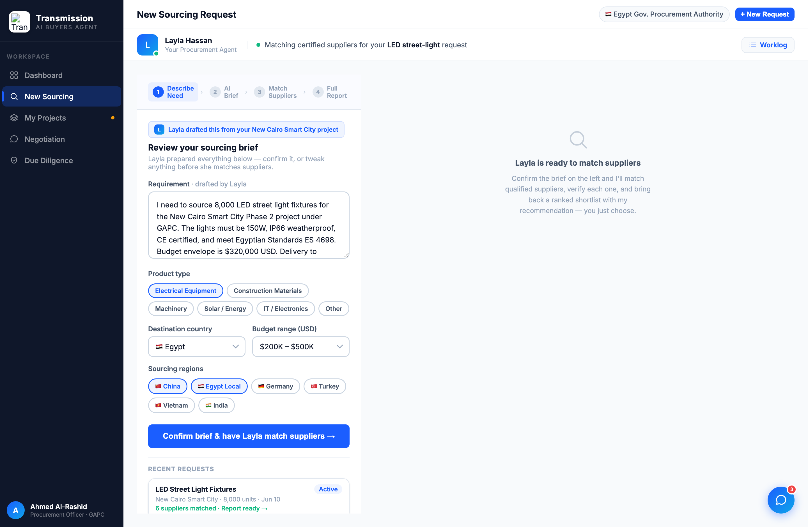

# Round 015 · ⬜ Polish · 助理 persona 统一(Layla)

- **时间**:2026-06-25 · 档:⬜ Utility(polish/audit pass 第一轮)· 自主模式(不暂停)
- **做了什么**:全应用泛指「AI/procurement specialist / your agent」统一为单一助理 **Layla**:
  - sourcing 右栏 empty:「Your AI Procurement Specialist」→「Layla is ready to match suppliers」+ 重写副文案(确认 brief → 我去匹配核验 → 给排名 shortlist + 推荐,你只选)。
  - diligence loading:「Your procurement specialist is cross-referencing…」→「Layla is cross-referencing customs/registration/financial/sanctions…」。
  - compare loading:「Your procurement specialist has already weighed…」→「Layla has already weighed… her verdict」。
  - sourcing report callout:「Your agent has flagged…」→「Layla has flagged…」。
  - procurement「AI Procurement Recommendation」卡标题 →「Layla's recommendation」。
  - 保留:产品品牌名「AI Buyers Agent」(title/contact-modal)、供应商描述「IoT specialist」(领域词,非助理)。
- **验收**:sourcing headless 无 stderr;纯文案;跨视图 persona 一致 ✓ · 3 critic 3/3 KEEP(产品:单一真人助理 persona 更强;视觉:无回归)。
- **截图**:
- **落库**:写报告 + 台账。自主模式续 ScheduleWakeup(60)。
