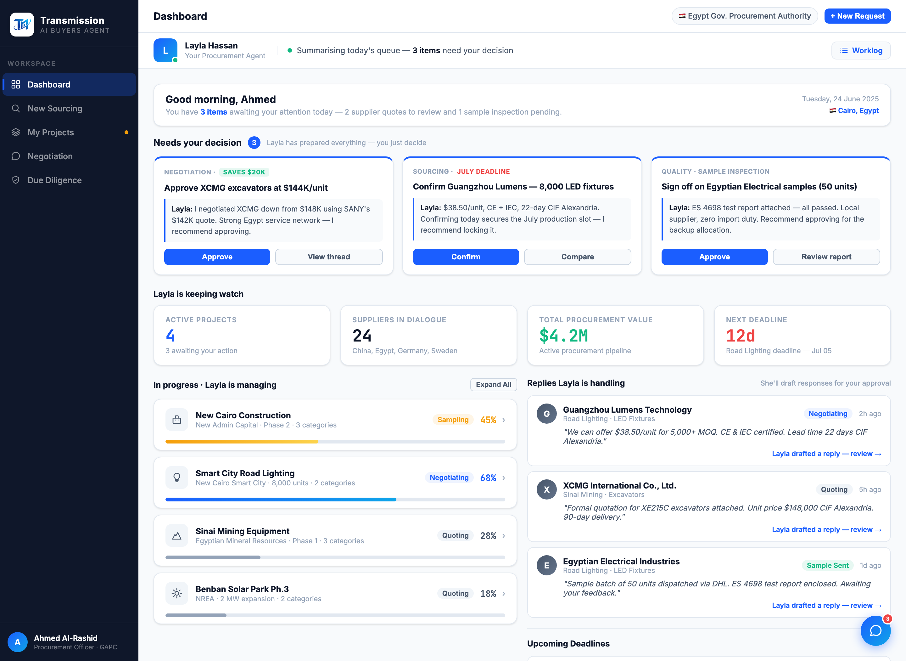

# Round 016 · ⬜ Polish · dashboard 回复零负担化

- **时间**:2026-06-25 · 档:⬜ Utility · 自主模式
- **做了什么**:dashboard「Replies Layla is handling」3 张供应商更新卡的「Click to reply →」→「Layla drafted a reply — review →」。与 R012 的 section 标题「She'll draft responses for your approval」+ 零负担北极星一致 —— 买方不再亲自回复,助理已起草,买方只审。
- **验收**:dashboard headless 无 stderr · 纯文案 · 3/3 KEEP(产品:消除 dashboard 最后一处「买方亲自回复」叙事)。
- **截图**:
- **落库**:报告 + 台账。自主模式续 ScheduleWakeup(60)。
