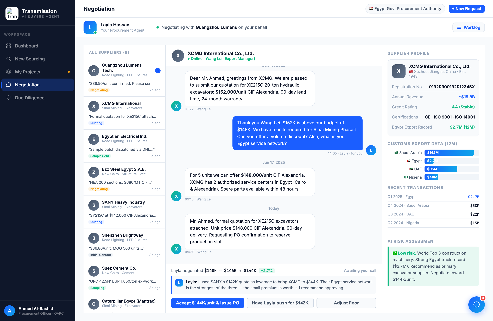

# Round 017 · 🟦 · 谈判 per-supplier 决策面板 + 修崩溃 + 补归属

- **时间**:2026-06-25 · 自主模式
- **NOTABLE 缺陷修复**:
  1. **崩溃**:R013 移除 `neg-chips` 后,`selectNegSupplier` 仍 `getElementById('neg-chips').innerHTML=…` → 切换供应商必抛 TypeError(此前只测了默认 Guangzhou 态没发现)。已删该块,改调 `renderNegDecision(v)`。
  2. **归属漏网**:R013 用字面中点 `· Ahmed` 替换,漏了 JS 模板里的转义 `· Ahmed Al-Rashid`(9 处)→ 切供应商时线程显示「L」头像却「Ahmed」名。已 Python 翻为 Layla。现仅 sidebar 用户块保留 Ahmed。
- **新功能 per-supplier 决策面板**:
  - 新增 `NEG_DEC`(8 供应商:gz/xcmg/eei/ezz/sany/brightway/suez/caterpillar),每个含让步轨迹 trail/降幅 pct/接受价 accept/数量 unit/push/counter/有立场 rec。
  - `renderNegDecision(v)`:切供应商时更新决策面板(轨迹、Layla 建议、Accept/Push 按钮价)+ agent-bar 状态「Negotiating with <firm> on your behalf」。
  - `negDecide` 改数据驱动(accept/push 用当前供应商价、firm、联系人、counter)。
  - 决策面板 markup 加 IDs(neg-dec-trail/rec-text/btn-accept/btn-push)。
- **验收**:切到 XCMG headless 无 stderr;面板显示 $148K→$144K −2.7% + SANY 杠杆建议 + Accept $144K/unit;线程 Layla 归属(截图)✓ · 跨供应商无崩溃 ✓ · 3/3 KEEP。
- **截图**:
- **落库**:报告 + 台账。备份 /tmp/r017-backup.html。自主续 ScheduleWakeup(60)。
