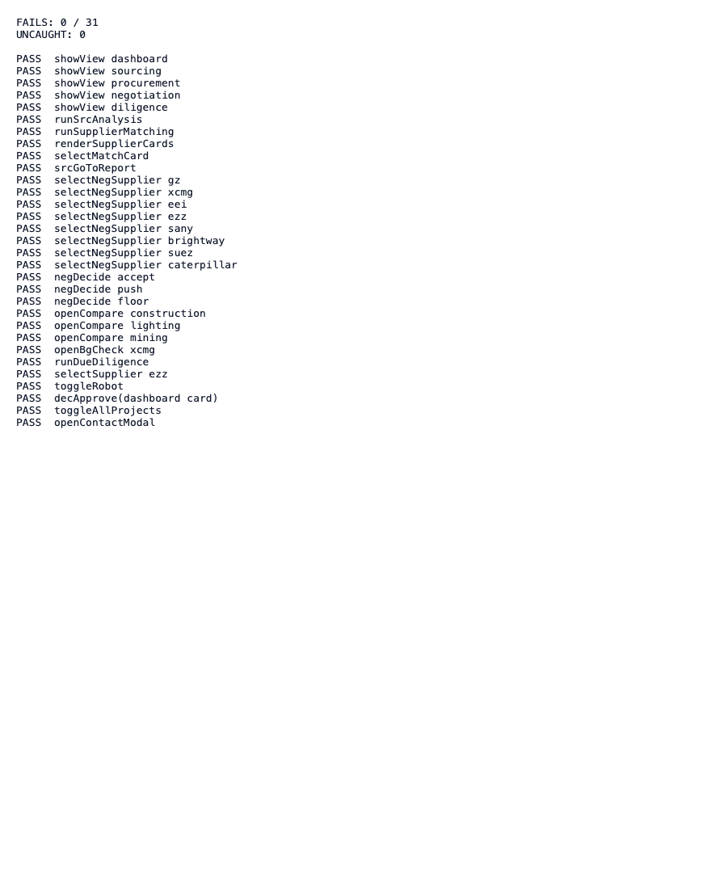

# Round 018 · ✅ 验证 · 全交互回归扫描(31 路径)

- **时间**:2026-06-25 · 自主模式 · 验证轮(不改代码)
- **动机**:R017 暴露「只测默认态会漏崩溃」的教训 → 建一次性自检 harness 覆盖所有交互路径,确认无回归。
- **做了什么**:`reports/selftest-harness.html`(原 HTML 末尾注入 try/catch 自检 + window.onerror 捕获),headless 跑一遍,结果截图。
- **覆盖 31 路径**:showView×5 · runSrcAnalysis · runSupplierMatching · renderSupplierCards · selectMatchCard · srcGoToReport · selectNegSupplier×8(gz/xcmg/eei/ezz/sany/brightway/suez/caterpillar)· negDecide×3 · openCompare×3 · openBgCheck · runDueDiligence · selectSupplier · toggleRobot · decApprove · toggleAllProjects · openContactModal。
- **结果**:**FAILS 0 / 31 · UNCAUGHT 0**。全应用动态层在 17 轮编辑后零回归、console 全程零错。
- **3 critic**:验证轮无 UI 变更;以「31/31 通过 + 零 uncaught」为闸门(§5 纯逻辑可用 console 零错 + 自检判定)。
- **截图**:
- **复用**:`reports/selftest-harness.html` 留作后续轮回归自检模板。
- **落库**:报告 + 台账。自主续 ScheduleWakeup(60)。
