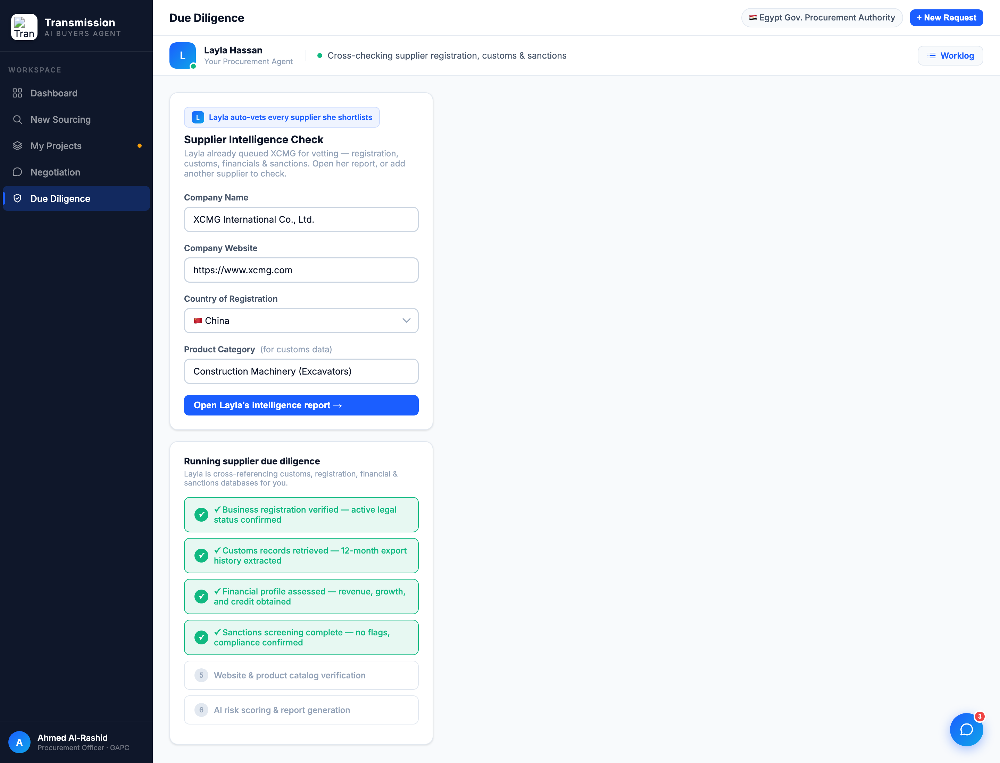

# Round 019 · ✅ 审计 · 深层状态巡检(无缺陷)

- **时间**:2026-06-25 · 自主模式 · 审计轮(无改动)
- **查了什么**:此前未细看的深层状态 ——
  - diligence 运行态(`runDueDiligence`):分阶段 loader,4 项绿勾真出结论 + 后续步骤,真出结果非假转圈 ✓
  - procurement「Communication Progress」:`step-dot` 用语义态(done/active/pending),非撞色 ✓
  - 供应商 briefing 头像 `bf-ava` 用 `d.color`(R005 已统一 slate)✓
  - export bars 单一蓝(R007)✓
- **结论**:深层状态无缺陷、无新可改项。两条北极星已强对齐,动态层 31/31 回归通过(R018)。
- **收敛**:连续 2 轮无肉眼可见提升(R018 验证 + R019 审计)。**收敛计数 2/3**。
- **截图**:
- **next**:再给一轮找真实可视改进;若仍无,则按 §收敛发 digest + 降 cadence(60s→1800s)。
