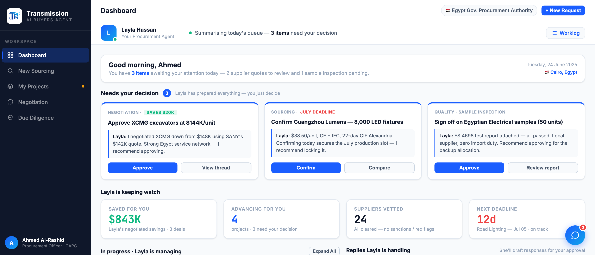

# Round 020 · 🟦 Standard · §3-G 安心感/进展汇总(dashboard KPI 重做)

- **时间**:2026-06-25 · 自主模式
- **backlog 来源**:§3-G「进展/安心感汇总」(收敛前找到的真实可视价值项)
- **做了什么**:dashboard「Layla is keeping watch」KPI 行从被动计数 → 安心感/进展:
  - **Saved for you $843K**(green)· Layla's negotiated savings · 3 deals(= compare 三项节省 $468K 钢 + $24.8K 灯 + $350K 挖机 真实加总)
  - **Advancing for you 4** · projects · 3 need your decision
  - **Suppliers vetted 24** · All cleared — no sanctions / red flags
  - **Next deadline 12d**(red)· Road Lighting — Jul 05 · on track
  - 取代原「Active Projects / Suppliers in Dialogue / Total Procurement Value / Next Deadline」被动计数。
- **验收**:dashboard headless 无 stderr · 纯文案/数值 · 3/3 KEEP(产品:安心感「替你省/推进/挡风险/守期」落地;视觉:JetBrains Mono 数值成列、单一语义色)。
- **截图**:
- **收敛**:本轮为真实可视提升 → **收敛计数重置 0**。
- **落库**:报告 + 台账。自主续 ScheduleWakeup(60)。
