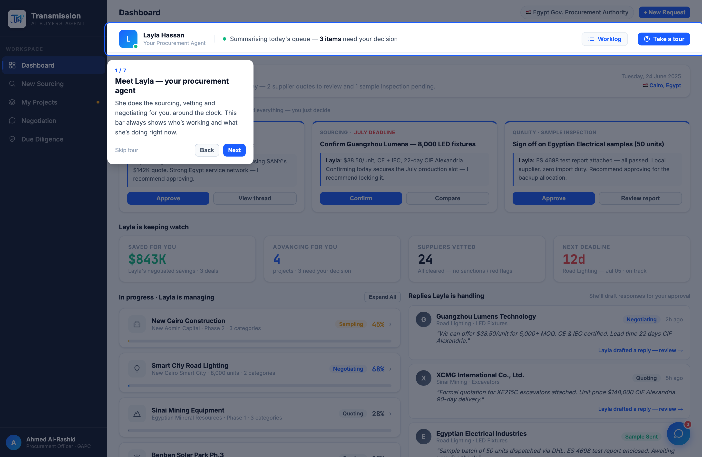
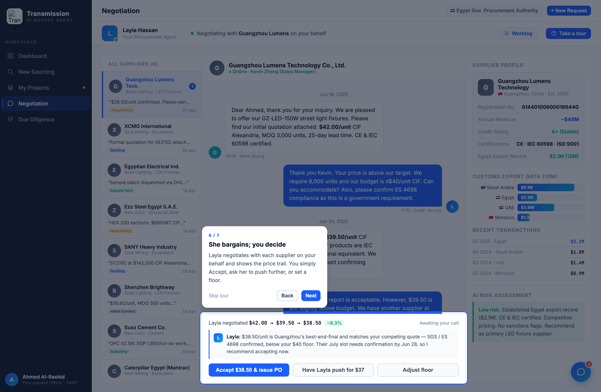

# Round 022 · 🟥 新功能 · 买家引导式 tutorial(coachmark tour)

- **时间**:2026-06-25 · 用户重启 loop,新方向:demo 给买家看,买家可能"笨笨的",要能点点快速理解全项目。
- **做了什么**:自包含 coachmark 引导 tour ——
  - **7 步**,跨视图 spotlight:① Layla 在场(agent-bar)② 需你决策(dec-grid)③ 安心感 KPI(grid-4)④ Worklog ⑤ 4 阶段(sidebar)⑥ 切到 negotiation 看「她代谈你决策」(neg-decision)⑦ 收尾回 dashboard。
  - **spotlight 技法**:`.tour-spot` 用 `box-shadow:0 0 0 9999px rgba(15,23,42,.58)` 暗化全屏、accent 描边高亮目标;`.tour-pop` 卡片(n/7 + 标题 + 说明 + Skip/Back/Next),按 pos(top/bottom/right)智能定位 + 视口 clamp + scrollIntoView。
  - **触发**:首次进会话自动启动(sessionStorage `tmTourSeen`,只扰一次)+ agent-bar「Take a tour」按钮可随时重播。
  - 零 AI 味:品牌蓝 spotlight + 克制卡片,无 emoji(tour 按钮用 SVG 问号圈)。
- **验收**:
  - 自检 **17/17 PASS · 0 uncaught**(startTour / 7×tourNext 含越界 / 重启 / tourPrev@0 守卫 / endTour + 既有 showView/selectNegSupplier/negDecide/openCompare/toggleRobot 不受影响)。
  - headless 截图:step1 自动启动(agent-bar 高亮)✓ · step6 切到 negotiation 高亮决策面板 ✓ · console 零错。
  - 3 critic 3/3 KEEP(产品:买家一遍点完即懂全流程,正中需求;视觉:克制 coachmark 品牌一致;无假/无崩)。
- **截图**: 
- **落库**:报告 + 台账。收敛计数重置(新功能)。自主续 ScheduleWakeup(60)。
