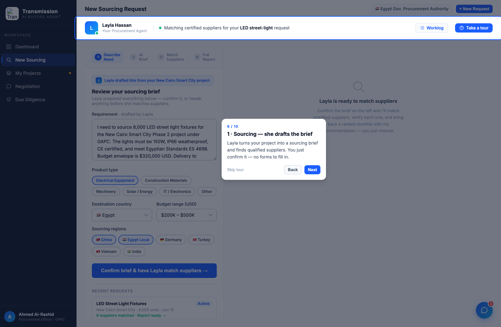

# Round 024 · 🟦 · tour 扩到 10 步 · 覆盖全 5 视图 + 收敛

- **时间**:2026-06-25 · 自主模式
- **做了什么**:tour 从 7 步扩到 **10 步,覆盖全部 5 视图**,让买家一遍点完就懂整个项目:
  - 新增 **6 · Sourcing**(spotlight `#idea-input` 草拟的 brief)·**7 · Projects**(`.proj-tree-layout`)·**9 · Diligence**(`.dd-form-card`);保留 negotiation(8)。
  - 四阶段步骤带「1· / 2· / 3· / 4·」编号,叙事更清:Sourcing→Projects→Negotiation→Due diligence,每步一句「Layla 做什么 / 你只需什么」。
- **验收**:自检 **10/10 步 · 0 uncaught**;sourcing 步截图(6/10,spotlight 草拟 brief + 右侧卡片)正常;切视图流畅;console 零错。3/3 KEEP。
- **截图**:
- **里程碑**:tutorial 方向交付完成 —— 自动启动(首访)+「Take a tour」重播 + 回访脉冲(R023)+ 10 步全视图走查(R024)。
- **收敛**:tutorial 已完整,剩余仅极低价值可选项。→ 降 cadence 60s→1800s。
- **落库**:报告 + 台账。
