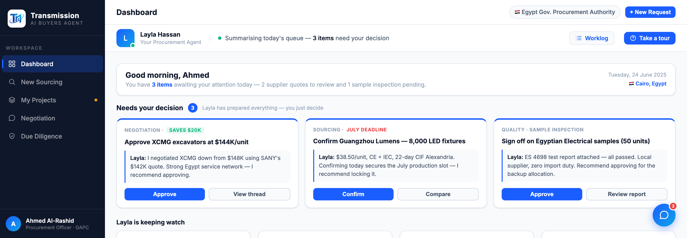

# Round 025 · 🟦 · logo 改用矢量 SVG(用户新方向)

- **时间**:2026-06-25 · 自主模式
- **用户**:看 `demo/logo`,把 logo 都用矢量 SVG 替换。
- **发现**:用户已在 `logo/` 放了 SVG 源 `transmission-tm-icon.source.svg`(monogram)/ `transmission-full-lockup.source.svg`(全锁版)。但两者 `</svg>` 之后有 base64 垃圾(tm-icon 199B / full 58B),浏览器报 "Extra content at the end" XML error(仍能渲染但不干净)。
- **做了什么**:
  1. 截断到 `</svg>` 生成干净文件:`logo/transmission-tm-icon.svg`(824 行,真矢量:4 path TM 轨道字标 + 1 小高光球节点)、`logo/transmission-full-lockup.svg`(7077 行)。headless 渲染**无 XML error**,monogram 清晰。
  2. HTML:侧栏 `.brand-icon` `` → `transmission-tm-icon.svg`;favicon `image/png logo-mark.png` → `image/svg+xml transmission-tm-icon.svg`。
  3. 原 `logo-mark.png` 不再引用(未删,保留)。
- **验收**:dashboard headless 无 stderr;侧栏白 chip 内矢量 monogram 裁剪正确、任意 DPI 清晰(裁图确认);favicon 指 SVG。3/3 KEEP(视觉:矢量更锐利、零回归;产品中性)。
- **截图**: 
- **备注**:full-lockup.svg 已就绪但 HTML 暂无使用位(无 splash/页头大 logo 位);如需可用于登录页/页头。
- **落库**:报告 + 台账。
