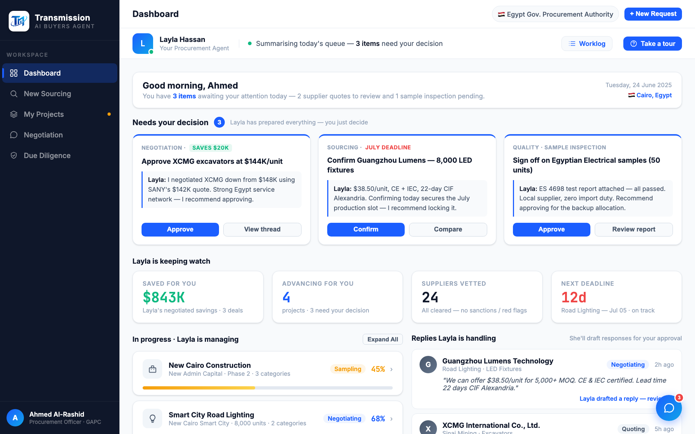
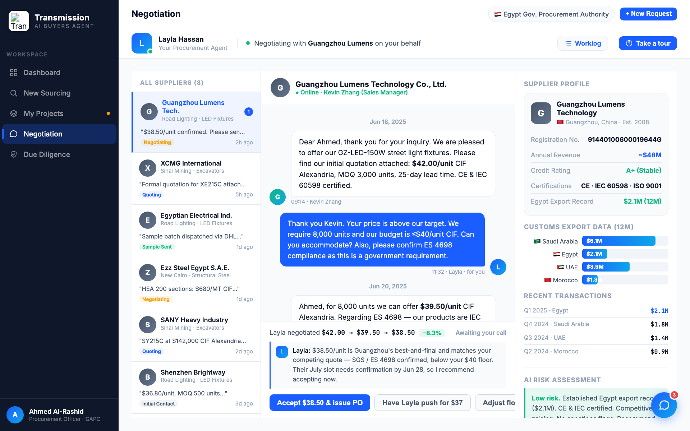

# Round 027 · ✅ 审计 · 常见笔记本宽度核验(无需改动)

- **时间**:2026-06-25 · 自主模式 · 谨慎优化扫描
- **查了什么**:demo 在常见笔记本宽度(1280×800,device-scale 1.5)下的表现 —— 买家多用 1280/1366 屏。
  - **Dashboard**:agent-bar(Layla+状态+Worklog+Take a tour)单行不挤;决策卡 3 列、KPI 4 列、下方两栏均正常,无溢出。
  - **Negotiation**:3 列布局(供应商 240 + 聊天 1fr + 档案 300)在 1280 下完整 —— 聊天可读、决策面板三按钮齐、右档案完好。
- **结论**:常见笔记本宽度稳健,无破版/拥挤,**无需改动**。
- **本轮判断**:谨慎优化已做完该做的(R026 键盘导航);再改即"凑改动",按用户指示**不动**。demo 回收敛态。
- **截图**: 
- **落库**:仅 docs(报告+台账);live 站点无变化,不需 cp index.html。降回 1800s 低频心跳。
