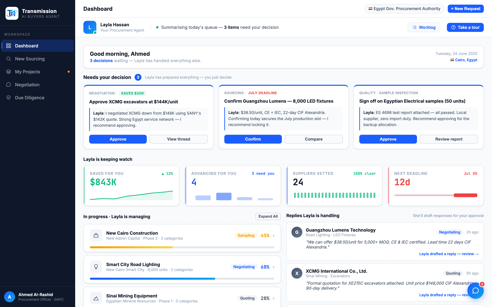

# Round 028 · 🟦 · 首页可视化 + 减字 + 科技感(第一步)

- **时间**:2026-06-25 · 自主模式 · 新方向(参考 reference/factorygate;选定:亮色 + 加科技感/可视化,低风险)
- **用户痛点**:首页文字太多、纯文字、信息过载;要更多可视化 + 科技感。
- **做了什么**(dashboard,contained):
  1. **KPI 行可视化**:4 卡各加 mini-viz inline SVG —— Saved $843K 上升 area sparkline(green)/ Advancing 4 个项目 bar chart(accent,高度=各项目进度)/ Suppliers vetted 24 根 tick 条(green,= 24 家全清)/ Next deadline 倒计时条(red,已耗 vs 剩 12d)。卡片加 topline delta(▲12% / 3 need you / 100% clear / Jul 05)+ 左侧语义色 rail。
  2. **减字**:greeting 长句 → 「3 decisions waiting — Layla has handled everything else.」;KPI 去掉 sub 文字墙,用 viz + delta 承载。
  3. **科技感**:dashboard 内容区加克制点阵网格背景(radial dot grid,rgba .05,24px)—— Linear/Stripe 式 tech 纹理,subtle 不喧。
- **验收**:headless 无 stderr;KPI viz 渲染清晰(裁图确认);点阵 subtle;纯静态 SVG 不触 JS。3/3 KEEP(视觉:科技感↑可视化↑文字↓;产品:扫读更快不退步;无 slop)。
- **截图**: 
- **落库**:报告+台账;cp index.html;commit+push(live 更新)。后续继续逐屏加 viz(项目区/趋势图/右栏)。
