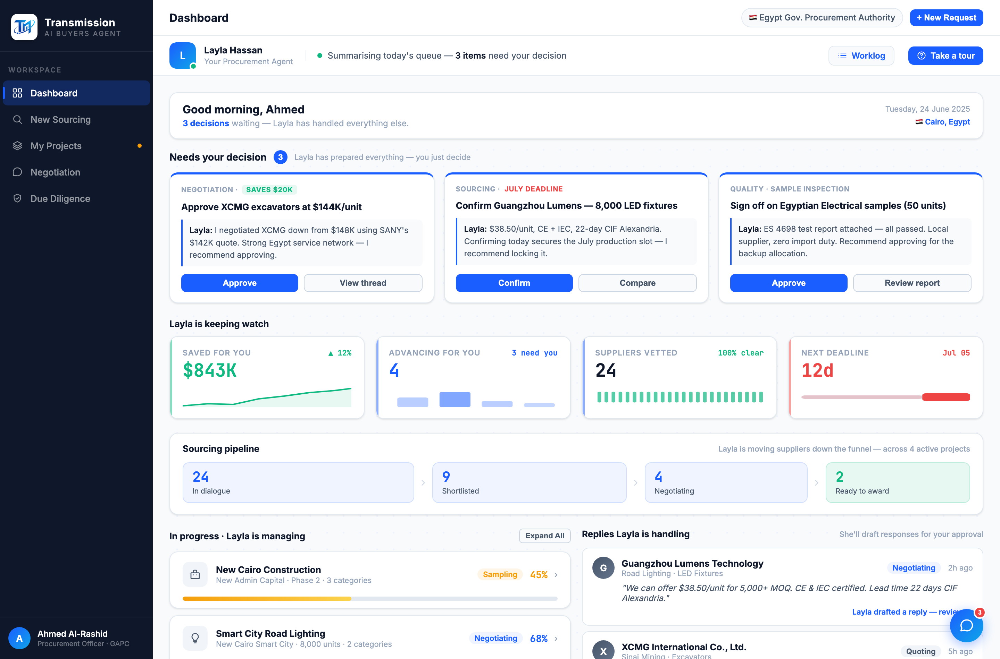

# Round 029 · 🟦 · Sourcing pipeline 漏斗可视化(首页可视化第二步)

- **时间**:2026-06-25 · 自主模式 · 新方向逐屏迭代
- **做了什么**:dashboard 在 KPI 行与两栏区之间新增「Sourcing pipeline」漏斗卡 —— 24 In dialogue → 9 Shortlisted → 4 Negotiating → 2 Ready to award(green-win),锥形 flex 宽度 + chevron 连接 + accent 渐降。一眼看清 Layla 把供应商往下推的漏斗,替代读数字。
- **审计判断**:项目进度区(In progress)已有进度条 + 5 段 stage dots,够视觉,不强改;漏斗是更高价值的新视觉锚点。
- **验收**:headless 无 stderr;漏斗渲染正确(锥形 + green 末段);纯静态 SVG/markup 不触 JS;subtle 不 slop(单 accent + green 语义,mono 数字)。3/3 KEEP(视觉:可视化/科技感↑;产品:采购漏斗有意义、扫读快;无 slop)。
- **截图**:
- **落库**:报告+台账;cp index.html;commit+push。
- **next**:总览趋势图 / 右栏 Replies 精简可视化。
