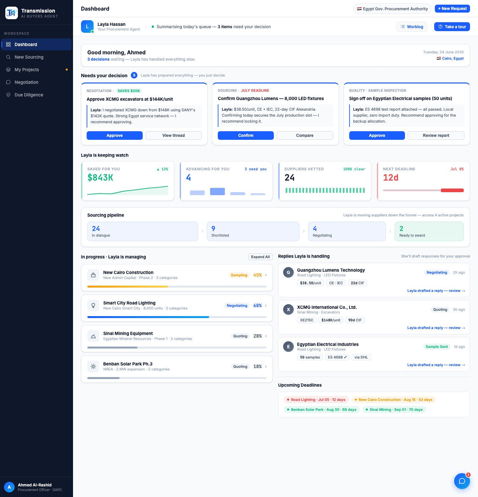

# Round 031 · ✅ 审计 · 首页改造整体核验(无改动)

- **时间**:2026-06-25 · 自主模式
- **做了什么**:全页 dashboard 截图 + 回归自检。首页减字/可视化/科技感三步(R028 KPI mini-viz / R029 漏斗 / R030 fact chips + 点阵网格 + 砍字)整体核验:
  - **整体观感**:从上到下 greeting(精简)→ 决策卡 → KPI mini-viz → Sourcing 漏斗 → 项目进度(条+stage dots)+ Replies(fact chips)→ deadlines。层级清晰、视觉锚点多、文字密度明显下降,像 command center,不再纯文字墙。
  - **回归**:全交互自检 **FAIL:0 · UNCAUGHT:0**(5 视图 + openCompare + selectNegSupplier + decApprove + tour)。
- **结论**:首页方向交付到位,符合「减负 overload + 多可视化 + 科技感(亮色)」。不再堆首页。
- **截图**:
- **收敛**:本子方向完成 → 降回 1800s 低频心跳,向用户提供后续可选项(其它视图同款 viz / 入场微动效 / 趋势图)。
