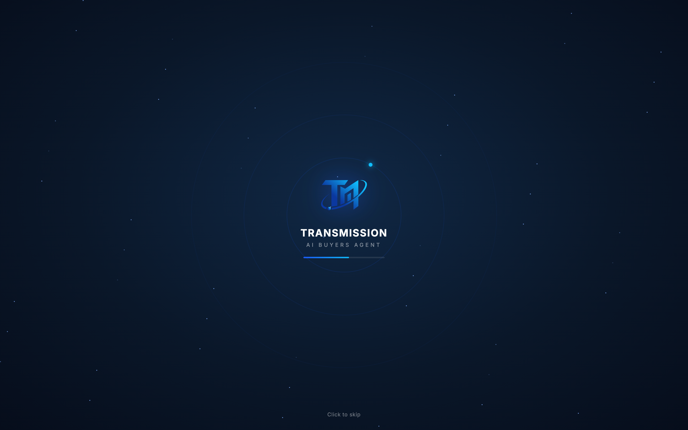
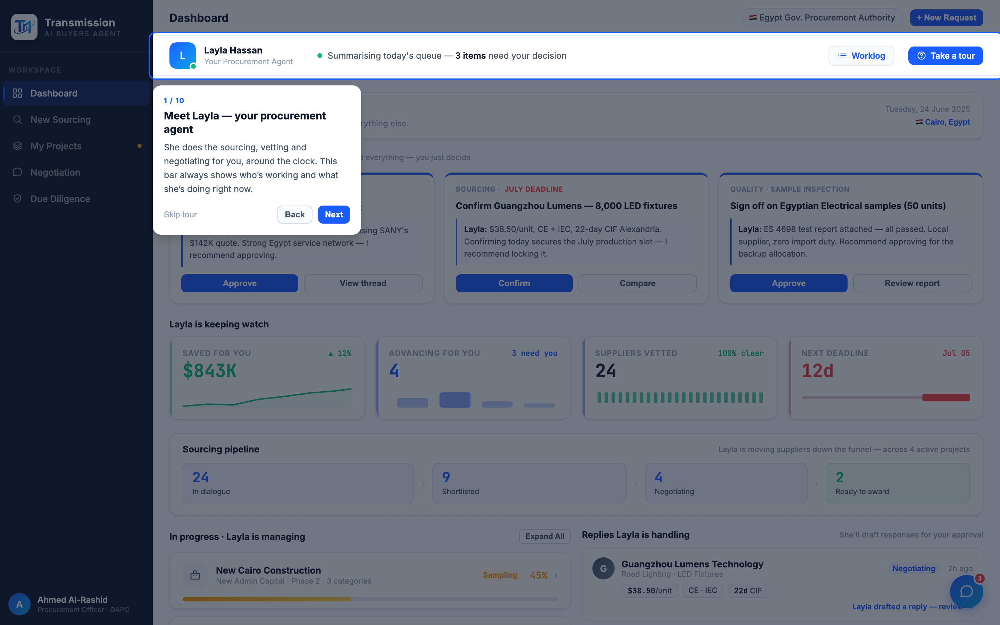

# Round 032 · 🟦 新组件 · 开场 splash(科技感入场)

- **时间**:2026-06-25 · 自主模式 · 新方向(加 factorygate 没有的组件:开场 + 科技感 + 地图)
- **做了什么**:新增**开场 splash**(参考 factorygate 深色星空/轨道入场):
  - 深 navy 径向渐变 + 52 颗 twinkle 星点 + 3 圈旋转轨道环(o1 带 cyan 节点)+ 居中**发光矢量 TM logo** + 「TRANSMISSION · AI BUYERS AGENT」+ 1.7s 加载条 + 「Click to skip」。
  - 时序:首次进会话 splash 播 ~2.3s(或点击跳过)→ 淡出 → 揭示 app → afterIntro()(未看过 tour 则自动开 tour;看过则脉冲 tour 按钮)。`sessionStorage tmSplashSeen` 每会话只播一次;回访直接隐藏。
  - `prefers-reduced-motion` 关闭轨道/星点动画。
  - 重写原 auto-tour-on-load 逻辑并入 afterIntro,避免重复触发。
- **验收**:splash 截图(星空+轨道+发光 logo)✓;3.6s 后 app+tour 正常揭示 ✓;自检 **FAIL:0 UNCAUGHT:0**(splash 退场 + 5 视图 + openCompare + selectNegSupplier + tour)✓;reduced-motion 守卫 ✓;click-skip + 2.3s timeout 双重不卡死。3/3 KEEP。
- **截图**: 
- **落库**:报告+台账;cp index.html;commit+push。
- **next**:大组件「交互地图(游戏感)」—— Egypt/全球采购地图,供应商/项目标记,hover/click/pulse 交互。
