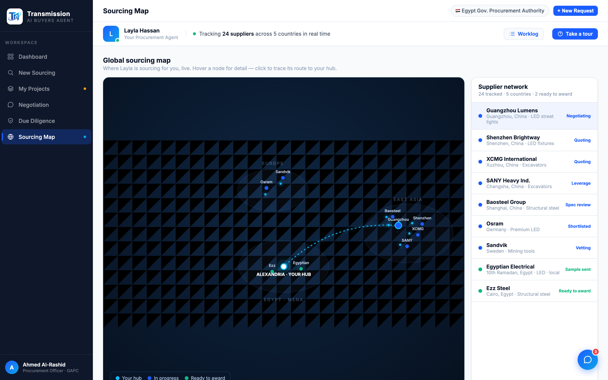

# Round 033 · 🟥 大组件 · 交互式 Sourcing Map(科技感 + 游戏感)

- **时间**:2026-06-25 · 自主模式 · 新方向(加 factorygate 没有的组件:地图,要交互/游戏感)
- **做了什么**:新增第 6 视图 **Sourcing Map**(深色 command-center 风,亮色 app 内的沉浸式面板):
  - 集成:`VIEWS/TITLES/AGENT_STATUS` 加 `map`;侧栏加「Sourcing Map」nav(globe icon + dot);`showView('map')` → 懒渲染 `renderMap()`。
  - 地图:深 navy 径向底 + 网格 pattern + 三个 region 椭圆(EAST ASIA / EUROPE / EGYPT·MENA)+ 区域标签;**中心发光 hub「ALEXANDRIA · YOUR HUB」**(脉冲);9 个供应商节点按地理分布(中国簇 5 + 欧洲 2 + 埃及本地 2),蓝=in-progress / 绿=ready;每节点→hub **二次贝塞尔弧线 route**(虚线流动 + SMIL animateMotion 传输小点 = shipments en route 游戏感)。
  - 交互:hover 节点 → 跟随光标的 tooltip(名/地区/品类/状态);click 节点(或右侧列表项)→ 该 route 高亮 cyan + 其余 dim + 节点放大 + 列表同步选中;点空白处 mapReset。右侧 supplier 列表(24 tracked · 5 countries)。legend。
  - `preserveAspectRatio=meet` 保证全节点不裁;`prefers-reduced-motion` 由 splash 段守卫(轨道/星点),map 流动为 SMIL。
- **验收**:map 截图(全节点 + hub + 选中 Guangzhou route 高亮 cyan、余 dim)✓;全回归自检 **FAIL:0 UNCAUGHT:0**(6 视图 + renderMap×2 幂等 + mapSelect/mapReset + openCompare + selectNegSupplier + tour)✓;无 page error。3/3 KEEP(视觉:科技感/可视化大幅↑;产品:一眼看清全球采购网络 + 交互探索 game feel;无 slop——单 accent+green+cyan-hub,语义清晰)。
- **截图**:
- **落库**:报告+台账;cp index.html;commit+push。
