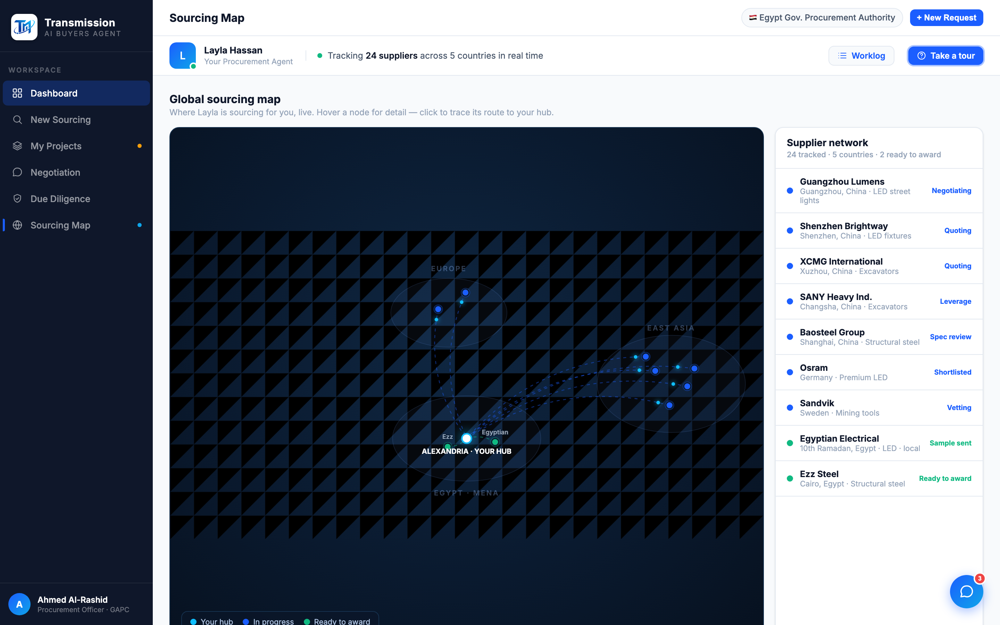

# Round 034 · ⬜ Polish · 地图标签防重叠(hover 揭示)

- **时间**:2026-06-25 · 自主模式 · 地图细节打磨
- **做了什么**:map 节点名标签默认隐藏(opacity 0),hover/选中才显示(transition);「ready」节点(Egyptian/Ezz)保留 .7 淡标签作为重点;标签加 `paint-order:stroke` + 深描边提升暗底可读性。解决 China 簇 5 节点标签重叠 → 默认干净 radar 观感,名字靠 hover tooltip + 右侧列表。「聚焦」由既有 click→route 高亮+dim+列表同步覆盖。
- **验收**:map 截图默认干净(节点发光+路由,hub+ready 标签)、无重叠 ✓;无 page error;hover/sel 揭示标签(CSS)✓。3/3 KEEP。
- **截图**:
- **落库**:报告+台账;cp index.html;commit+push。
