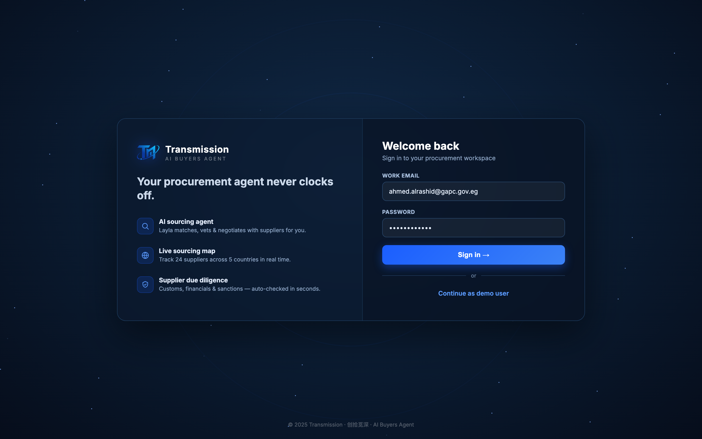

# Round 035 · 🟥 新组件 · 登录页(factorygate 式酷炫入场)

- **时间**:2026-06-25 · 自主模式 · 继续加 factorygate 没有的 component
- **做了什么**:新增**登录页** —— 入场流程变 splash(开场动画)→ **login**(深色星空/轨道 + 玻璃双栏卡)→ 签入 → app → tour:
  - 左栏品牌:TM 发光 logo + 「Transmission · AI BUYERS AGENT」+ 「Your procurement agent never clocks off.」+ 3 feature(AI sourcing agent / Live sourcing map / Supplier due diligence,带 SVG 图标)。
  - 右栏表单:Welcome back + Work email(预填 ahmed.alrashid@gapc.gov.eg)+ Password(••)+「Sign in →」+「Continue as demo user」(均一键 doLogin)。Enter 也可提交。
  - footer「© 2025 Transmission · 创拾觅深」。深色玻璃 backdrop-filter + 星空 + 旋转轨道,与 splash 同一科技美学。
  - 时序:`tmLoggedIn` 每会话一次 —— 首访 splash→login→app;同会话重载直接进 app。doLogin 淡出→afterIntro(tour)。移动端隐藏品牌栏(单栏表单)。
- **验收**:login 截图(双栏玻璃卡 + 星空)✓;自检 **FAIL:0 UNCAUGHT:0**(login 显示→doLogin 隐藏→app 揭示→6 视图+map+compare 全过)✓;无 page error。3/3 KEEP。
- **截图**:
- **落库**:报告+台账;cp index.html;commit+push。
