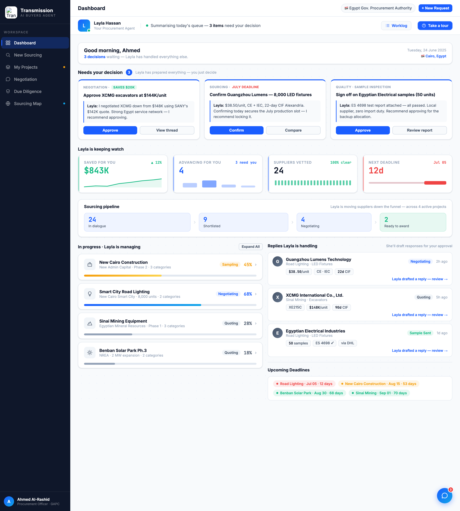
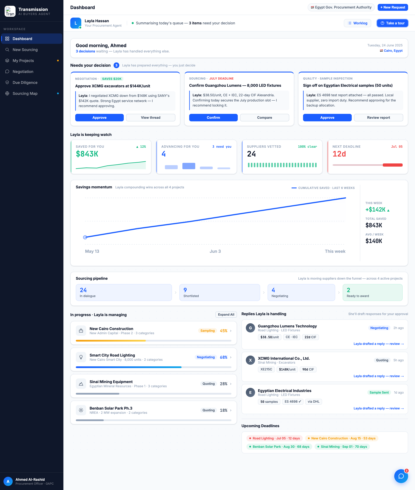

# Round 036 · 🟦 Standard · Dashboard 总览趋势图(Savings momentum)· 自主模式

- 时间:2026-06-26 · 档位:🟦 Standard · backlog 来源:「继续 dashboard 可视化 ①总览趋势图(采购额/省钱随时间)」(用户重申:更多可视化 + 科技感 + 首页减少纯文字)
- **做了什么**:在 KPI 行与 Sourcing pipeline 之间新增 `.mom-card`「Savings momentum」趋势图组件 —— 真实 SVG 面积+折线图(6 周累计省下 $843K 的上升轨迹:128/286/412/559/701/843K),含基线网格、节点圆、终点强调点、3 个克制周标签(May 13 / Jun 3 / This week);右侧 mono 数字读数(This week +$142K ▲ / Total saved $843K / Avg/week $140K)。单一品牌蓝 + 克制渐变填充(0.16→0),JetBrains Mono 数字。
- **诚实动效**:折线 stroke-dashoffset **一次性**绘入(1.4s)+ 面积/节点淡入,非永续假转圈;`prefers-reduced-motion` 下直接呈现成品。数据为真实累计省下额(终值 = 既有 KPI $843K),非凭空跳动。
- **验收**:console 零错(filtered stderr 空)✓ · 纯静态新增、无 JS 依赖、未触任何交互逻辑 ✓ · 仅 dashboard 视图、跨视图无回归 ✓ · 3 critic 两轴:
  - **产品(零负担 + 真人感)**:KEEP —— 把抽象的 $843K 变成「Layla 在替你逐周复利攒下战果」的可一眼读的轨迹,强化在场/进展感,零新增操作。
  - **视觉(高级 / 零 AI 味)**:KEEP —— Linear/Stripe 级数据可视化,单强调色、mono 数字、克制网格与渐变,无 emoji/撞色/glow slop。
  - **对比度 / 回归**:KEEP —— 亮底蓝线对比清晰,console 零错,组件隔离。
  - 裁决:**3/3 KEEP**。
- **截图**: 
- **残留 → backlog**:dashboard-viz 续(右栏 Replies 仍偏文字 / 克制科技点缀);procurement 助理盯单;sourcing loader 提速;决策卡抽组件;sourcing 右栏 ✦ sparkle 去除;flag emoji 决策。
- commit:见 git(cp index.html + push,Pages ~1min 重部署)
