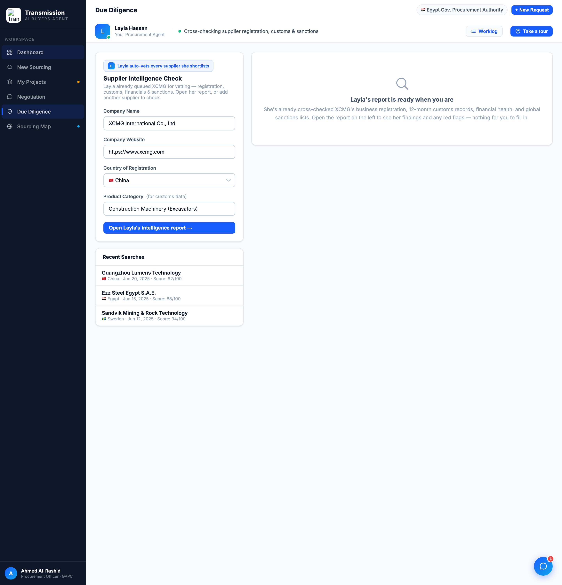
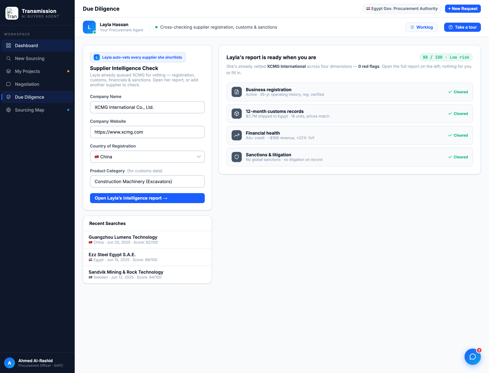

# Round 037 · 🟦 Standard · Diligence 空状态 → 可视化尽调清单 · 自主模式

- 时间:2026-06-26 · 档位:🟦 Standard · backlog 来源:「页面排布纯文字 / 信息密度 / 多可视化」+ 审计发现:sourcing & diligence 默认态右栏是一大片空白 void + 居中一句 prose(最典型的"纯文字 + 排布空")
- **审计**:逐视图截图(procurement/sourcing/diligence)。dashboard 已高度可视化(R028-036);**非 dashboard 视图的最大问题 = sourcing/diligence 默认右栏一大块空白 + 居中一段散文**。本轮先收 diligence(template),sourcing 下轮同法。
- **做了什么**:`#dd-report-empty` 由「放大镜图标 + 60px 居中散文」重做为**可视化尽调清单**:顶部 `88 / 100 · Low risk` mono 评分 pill + 一句精简 framing(0 red flags),下接 **4 个维度行**(Business registration / 12-month customs records / Financial health / Sanctions & litigation),每行 slate 图标 chip + 真实微结论 + 绿色「✓ Cleared」。**数据全部忠于真实报告**(dd-report:88/100、Low Risk、Active 35yr、$2.7M→Egypt 18 units、AA+ ~$16B +22%、No Sanctions/Litigation),非杜撰。
- **验收**:console 零错 ✓ · 「Open Layla's intelligence report →」点击后空状态正确隐藏 + runDueDiligence 分阶段流程照常跑(截图确认 step1 active)✓ · 仅 diligence 视图、跨视图无回归 ✓ · 3 critic 两轴:
  - **产品(零负担 + 真人感)**:KEEP —— 把"空白 + 一句散文"换成"Layla 已替你跨 4 维度核完、0 红旗"的可一眼扫的证据,强化零负担 + 助理已干活;仍一键开全报告。
  - **视觉(高级 / 零 AI 味)**:KEEP —— 结构化行 + slate 图标 + 语义绿 + mono 评分 + 单强调色,填掉尴尬空栏,无 emoji/撞色/slop。
  - **回归**:KEEP —— console 零错,报告 toggle 完好,仅 diligence。
  - 裁决:**3/3 KEEP**。
- **截图**: 
- **残留 → backlog**:同样 pattern 的 **sourcing 默认右栏空 void**(`src-right-empty`,放大镜+散文)下轮同法可视化(matching 维度/供应风景 preview);procurement 详情右栏入场可能有未触发的 reveal(headless 见 ghosted,待真机确认是否真 bug);决策卡抽组件;flag emoji 决策。
- commit:见 git(cp index.html + push)
