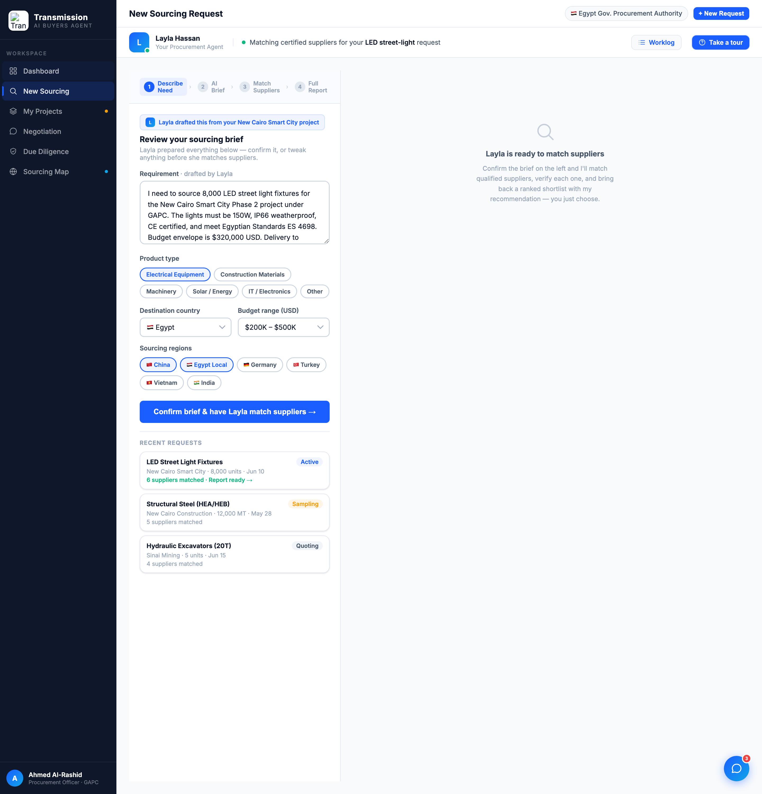
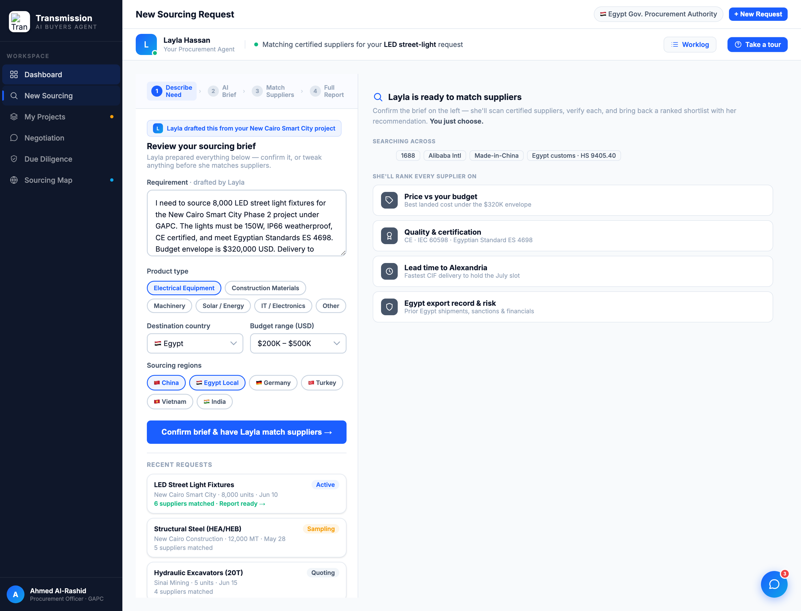

# Round 038 · 🟦 Standard · Sourcing 空状态 → 可视化匹配预览 · 自主模式

- 时间:2026-06-26 · 档位:🟦 Standard · backlog 来源:R037 续(sourcing/diligence 默认右栏空 void;diligence 已收,本轮收 sourcing)
- **做了什么**:`#src-right-empty` 由「放大镜 + 居中散文(`Layla is ready to match...`)」重做为**左对齐匹配预览**:标题 + 一句精简 framing(You just choose)+「Searching across」fact chips(1688 / Alibaba Intl / Made-in-China / Egypt customs · HS 9405.40)+「She'll rank every supplier on」4 条评分维度行(Price vs budget / Quality & certification CE·IEC·ES 4698 / Lead time to Alexandria / Egypt export record & risk),每行 slate 图标 chip + 真实描述。
- **诚实**:本视图动作**尚未运行**(需先确认 brief),故**不展示任何"已匹配"假结果** —— 预览呈现的是 Layla **即将执行**的真实流程(对应 ai-step:搜 1688/Alibaba/Made-in-China + 拉 Egypt 海关 + 核 CE/IEC + 按价/质/出口记录评分排序)。与 §4 红线一致,非杜撰。
- **验收**:console 零错 ✓ · 「Confirm brief & have Layla match suppliers →」(runSrcAnalysis)点击后空状态正确隐藏 + Procurement Brief / Supply Chain Overview 照常渲染 ✓ · 仅 sourcing 视图、跨视图无回归 ✓ · 3 critic:
  - **产品**:KEEP —— 空白 void → "助理将如何替你干"的可扫预览(来源 + 评分维度),强化 agent-does-the-work + you-just-choose,提前设定预期;无假结果。
  - **视觉**:KEEP —— 与 R037 diligence 行式一致,slate 图标 + fact chips + 单强调色,无 emoji/slop,填掉尴尬空栏。
  - **回归**:KEEP —— console 零错,confirm-brief toggle 完好,仅 sourcing。
  - 裁决:**3/3 KEEP**。
- **截图**: 
- **残留 → backlog**:两大 view 空状态 void 已收齐(R037 diligence + R038 sourcing);procurement 右栏 ghosted reveal 待真机确认;决策卡抽组件;flag emoji;地图游戏感增强(用户点名"地图交互/游戏感")可作下一较大件评估。
- commit:见 git(cp index.html + push)
