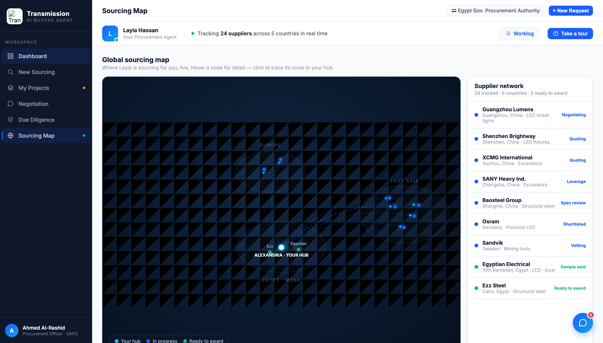

# Round 039 · 🟦 Standard · Sourcing Map 游戏感/交互感增强 · 自主模式

- 时间:2026-06-26 · 档位:🟦 Standard · backlog 来源:用户多轮点名「地图要有交互感 甚至一点点游戏感」
- **做了什么**(map 视图,纯增量交互):
  1. **双向 hover 追踪**:hover 任一节点 **或** 右侧 Supplier network 列表项 → 该供应商→Alexandria hub 的路由实时点亮(hot),其余路由 + flow 点淡出(dim),节点放大、列表项高亮。即时响应,鼠标移开(未选中时)自动复位。
  2. **一次性 "dispatch ping" 包**:点击选中 → 一颗发光包沿 hot 路由从供应商**疾驰到 hub**(1.05s spline ease,完后自动移除)—— command-center「派单/追踪」的游戏感。
  3. flow 流动点随高亮 dim/亮,选中态只剩目标路由在动,更聚焦。
- **诚实**:hover/ping 全是**用户触发的即时反馈**,非永续假进度;ambient flow 点为既有设计。`mapSel` 守卫:选中态下 hover 不会抢走当前选择。
- **验收**:console 零错(含选中态)✓ · 选中截图确认 hot 路由 + 其余 dim + ping 在途 + 节点放大 ✓ · 默认态截图确认基础渲染未坏 ✓ · mapSelect/mapReset/mapHover/mapUnhover 全接通 · 仅 map 视图、跨视图无回归 ✓ · 3 critic:
  - **产品**:KEEP —— 「Layla 的实时寻源网络」从静态图变成一碰就响应、点一下就派单追踪的活地图,正中用户「交互感/游戏感」诉求;无假进度。
  - **视觉**:KEEP —— cyan/green 语义保留,dim/hot 对比干净,ping glow 克制,无 emoji/slop,command-center 质感加强。
  - **回归**:KEEP —— console 零错,默认态完好,map-only。
  - 裁决:**3/3 KEEP**。
- **截图**: 
- **残留 → backlog**:地图可继续(选中态侧栏出 mini「trace 详情」卡:航线/交期/incoterm,真实数据;键盘 ←→ 切节点;移动端);procurement 右栏 ghosted reveal 真机确认;决策卡抽组件;flag emoji。
- commit:见 git(cp index.html + push)
