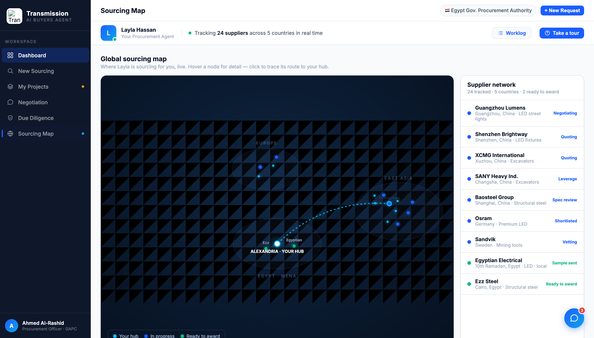
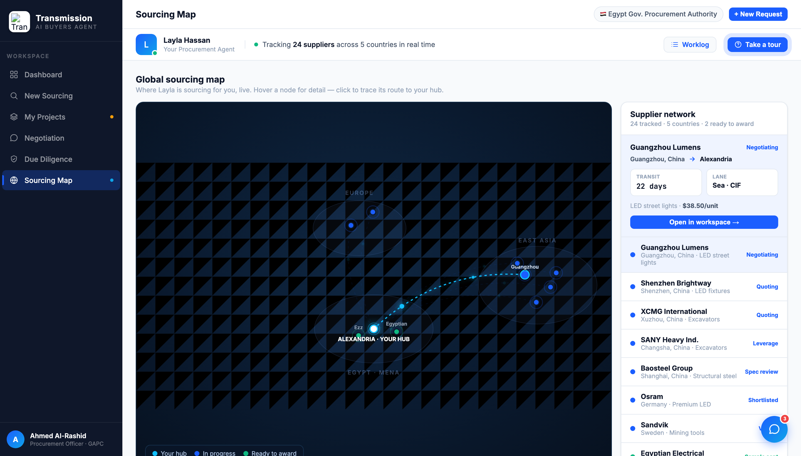

# Round 040 · 🟦 Standard · Map 选中态 trace 详情卡 · 自主模式

- 时间:2026-06-26 · 档位:🟦 Standard · backlog 来源:R039 next(地图选中态 mini trace 卡)+ 用户「地图交互/游戏感 + 多可视化」
- **做了什么**(map 视图,纯增量):点击选中节点时,右侧 Supplier network 头部下方新增 **trace 详情卡**(`#map-trace`):供应商名 + 状态色 + **航线 region → Alexandria**(箭头 glyph)+ 两个 mini stat(Transit `JetBrains Mono` / Lane incoterm)+ 供货品类 · 关键价(kpi)+「Open in workspace →」CTA(ready→procurement,其余→negotiation)。MAP_NODES 补 `transit/mode/kpi` 字段(9 家,与 demo 既有数据一致:gz 22d/CIF/$38.50、xcmg 90d/$144K、eei 14d local/$44 等)。
- **交互层次**:hover = 快速描线(R039);**click = 描线 + ping + 详情卡**。卡仅 click 出,hover 不触发(避免闪烁);mapReset(点空白)隐藏卡。
- **诚实**:lane/transit/incoterm 是 demo 既有口径的静态描述数据(非凭空 % / 非假进度);卡的出现由用户点击触发。
- **验收**:console 零错(含选中态)✓ · 选中截图确认卡渲染(Guangzhou 22 days · Sea·CIF · $38.50/unit + CTA)+ hot 路由 + ping ✓ · mapReset 隐藏卡(逻辑)· 仅 map 跨视图无回归 ✓ · 3 critic:
  - **产品**:KEEP —— 选中即得「trace 档案」(航线/交期/incoterm/价 + 一键进 workspace),地图从好看变成可决策面;强化「Layla 在替你盯这条线」。
  - **视觉**:KEEP —— light 卡与侧栏/dashboard 卡一致,mono transit,单 accent/green 语义,箭头 glyph,无 emoji/slop。
  - **回归**:KEEP —— console 零错,select 出卡 / reset 收卡,map-only。
  - 裁决:**3/3 KEEP**。
- **截图**: 
- **残留 → backlog**:地图续(键盘 ←→ 切节点循环 trace;选中态地图上画 origin/hub 端点标记);procurement 右栏 ghosted reveal 真机确认;决策卡抽组件;flag emoji。
- commit:见 git(cp index.html + push)
