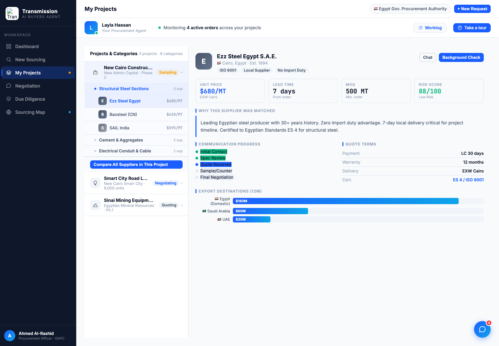
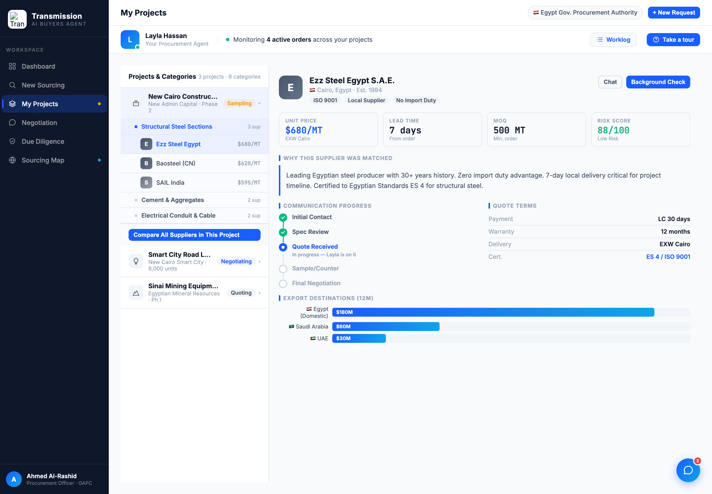

# Round 041 · 🟦 Standard · Procurement 通信进度 → 连接式阶段追踪器 + 非bug核实 · 自主模式

- 时间:2026-06-26 · 档位:🟦 Standard · backlog 来源:R040 next(procurement ghosted reveal 真机确认)+「多可视化 / 减纯文字列表」
- **审计核实(非bug)**:R037 看到的 procurement 右栏「ghosted/淡」**不是 bug** —— `selectSupplier` 第 3013 行 `rp.className='slide-up'`(opacity 0→1 入场动画,0.3s),headless 截图抓到了动画中途。settle 后/禁动画后右栏完全正常。已排除。
- **做了什么**(procurement briefing `buildBriefing`):「Communication Progress」从**纯竖排圆点+文字列表**升级为**连接式阶段追踪器**:5 阶段(Initial Contact→Spec Review→Quote Received→Sample/Counter→Final Negotiation)带 rail 连接线;done=绿实心+白勾,active=蓝实心+脉冲环+「In progress — Layla is on it」子标,pending=空心灰。数据驱动(`d.stages`),19 家供应商各按真实阶段渲染。
- **验收**:console 零错 ✓ · 两供应商(Ezz active@Quote / Guangzhou active@Sample)截图确认阶段态正确 + 切换重渲正常 ✓ · 仅 procurement(buildBriefing)、跨视图无回归 ✓ ·(截图为看清 stepper 临时禁了入场动画,非代码改动)· 3 critic:
  - **产品**:KEEP —— 订单阶段从一串点变成可一眼读的追踪器,active 段挂「Layla is on it」强化「助理在替你盯单」(§3-G);买方扫一眼知推进到哪。
  - **视觉**:KEEP —— rail+勾+脉冲,单 accent/green 语义,无 emoji,与 Worklog 时间线同级质感;把扁平点列升级成真 viz。
  - **回归**:KEEP —— console 零错,selectSupplier 跨供应商重渲正常;slide-up 淡入为既有设计非本轮引入。
  - 裁决:**3/3 KEEP**。
- **截图**: 
- **残留 → backlog**:procurement 可续(「需你决策」项浮出 / 异常红旗);地图键盘 ←→ 切节点;决策卡抽组件;flag emoji。
- commit:见 git(cp index.html + push)
