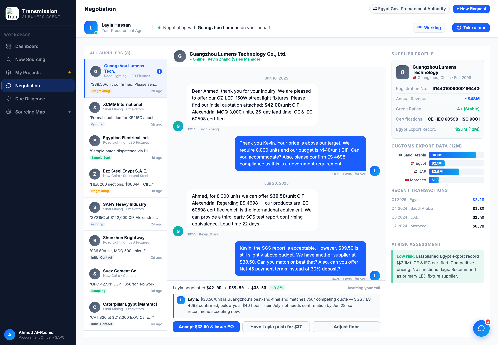
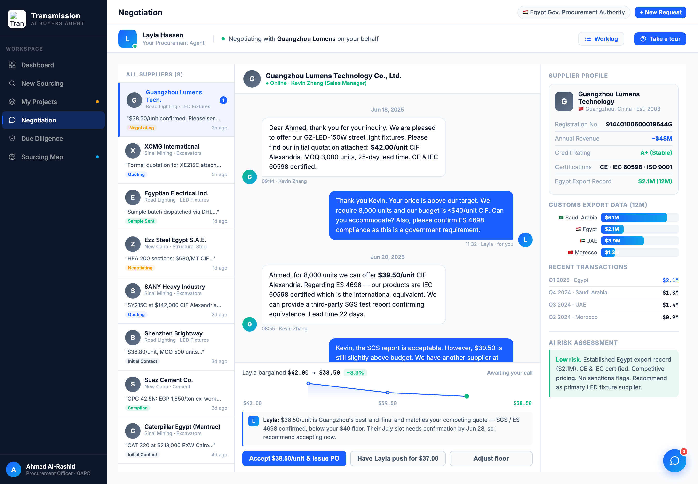

# Round 042 · 🟦 Standard · Negotiation 让步轨迹 → 压价 sparkline(看得见博弈)· 自主模式

- 时间:2026-06-26 · 档位:🟦 Standard · backlog 来源:negotiation 本 run 未审计 + §3-D「看得见助理替你来回博弈」+「多可视化」
- **审计**:negotiation 视图本就丰富(左供应商列表 / 中 Layla 代谈线程 / 右 profile+export 条+AI risk)。唯一纯文字的关键叙事 = 决策面板的**让步轨迹** `$42.00 → $39.50 → $38.50 −8.3%`。
- **做了什么**:决策面板加**压价 sparkline**(`#neg-dec-ladder`):由 `d.trail` 解析价点(`parseTrail`+`parsePrice`,支持 $ / K / M),画下降折线 + 面积渐变 + 节点(末点绿=成交),下方 mono 价标。轨迹文案精简为「Layla bargained $start → $final −pct」(避免与图标签重复)。`renderNegDecision` 注入图;`showView('negotiation')` 进入即渲染(默认 gz);`selectNegSupplier` 切换同步更新(L3485)。
- **诚实**:价点是真实 quote 轨迹(非动画/非假进度);一次性静态画。
- **验收**:console 零错 ✓ · gz($42→$38.50)/ xcmg($148K→$144K,K 解析正确)两态截图确认下降折线+绿末点+价标 ✓ · 切供应商更新(selectNegSupplier→renderNegDecision)· 面板无溢出 · 仅 negotiation 跨视图无回归 ✓ · 3 critic:
  - **产品**:KEEP —— 把「助理压价」从一行字变成可一眼读的下降曲线,买方**看得见** Layla 一轮轮把价谈下来(§3-D),强化代谈人感。
  - **视觉**:KEEP —— 下降折线+渐变+节点,单 accent + 绿成交点,mono 价标,紧凑无 emoji/slop。
  - **回归**:KEEP —— console 零错,进入/切换两路径都渲染,negotiation-only。
  - 裁决:**3/3 KEEP**。
- **截图**: 
- **残留 → backlog**:negotiation 可续(让步节点 hover 出当时上下文 / push 后 sparkline 加新点);procurement「需你决策/红旗」浮出;地图键盘 ←→;决策卡抽组件;flag emoji。
- commit:见 git(cp index.html + push)
