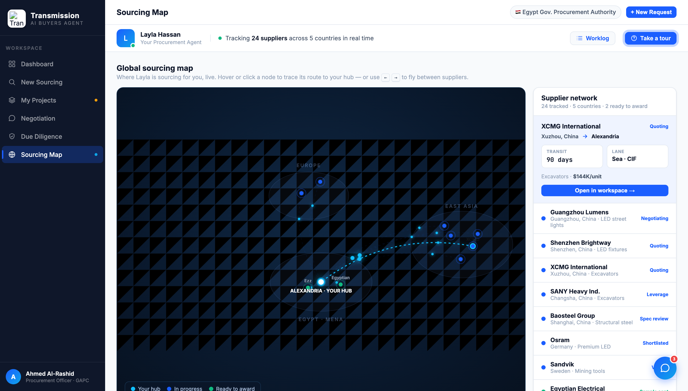

# Round 043 · 🟦 Standard · Map 键盘飞行导航(游戏感)· 自主模式

- 时间:2026-06-26 · 档位:🟦 Standard · backlog 来源:用户多轮点名「地图交互/游戏感」(R039-040 续)
- **审计**:复看 dashboard —— R028-036 后已是结构清晰的指挥中心(分区 + viz),不再是"信息过载",不强改。转最高诉求:地图游戏感。
- **做了什么**(map 视图,纯增量):**键盘飞行导航**——map 视图激活时,`← / →`(及 `↑ / ↓`)在 9 个供应商节点间循环选中,每次落点 = 描线 + dispatch ping + trace 详情卡(复用 R039-040);`Enter` 打开当前节点 workspace(ready→procurement 否则 negotiation);`Esc` 复位。守卫:仅 map 激活时生效,输入框/下拉/弹窗打开时忽略。`mapNavIdx` 在 `mapSelect` 同步 → 鼠标点击后再按方向键从该点续飞。header 副标题加 `←` `→` mono kbd 提示。
- **诚实**:全用户键入触发的即时反馈,无假进度。
- **验收**:console 零错 ✓ · 模拟两次 ArrowRight → 选中 node-bright(idx1)、trace 显示 ✓ · 三次 → XCMG(90 days/$148K)截图确认描线+ping+卡 ✓ · kbd 提示渲染 ✓ · 守卫(仅 map active)· 仅 map 跨视图无回归 ✓ · 3 critic:
  - **产品**:KEEP —— 方向键在供应商间"飞",地图像可操控的控制台(游戏感),每次落点出完整 trace 档案;`←→`提示可发现。
  - **视觉**:KEEP —— mono kbd 芯片克制一致,无 slop。
  - **回归**:KEEP —— console 零错,守卫充分,点击+键盘同步,map-only。
  - 裁决:**3/3 KEEP**。
- **截图**: 
- **★ 收敛观察**:本 run R036-043 已覆盖全 5 视图 + 地图的 viz/交互;地图(开场 splash/login + 交互 + trace + 键盘)已重度打磨。剩余皆细件(procurement 需你决策浮出 / 决策卡抽组件 / flag emoji)。**下轮起若只挖到细件,将向用户发 digest 报告"大件已完成"并视情况降 cadence。**
- **残留 → backlog**:procurement「需你决策/红旗」浮出;决策卡抽组件(无视觉);flag emoji 决策;negotiation push 后 sparkline 加点。
- commit:见 git(cp index.html + push)
