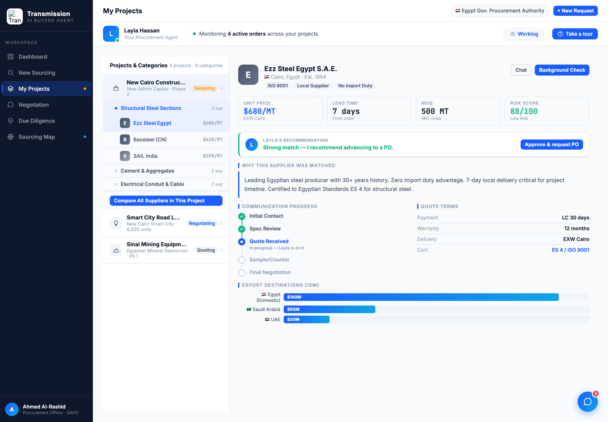
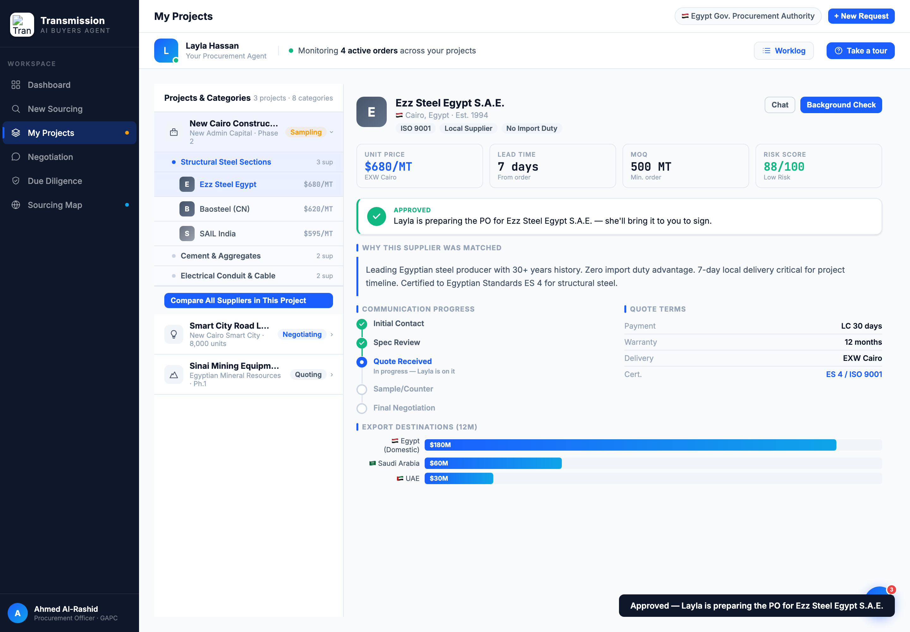

# Round 044 · 🟦 Standard · Procurement「Layla's recommendation」决策横幅(§3-G/§4)· 自主模式

- 时间:2026-06-26 · 档位:🟦 Standard · backlog 来源:procurement 助理盯单(§3-G)+ 审计缺口:供应商 briefing **看完没有明确决策/下一步**(违 north-star-2「看→决策」)
- **做了什么**(procurement `buildBriefing`):KPI 行下方新增**「Layla's recommendation」决策横幅**:Layla 头像 + 风险派生的有立场判语(risk≥85「Strong match — 建议进 PO」/ ≥80「Solid — cleared to advance」绿 / <80「Workable — 先看下方 caveats」amber)+「Approve & request PO」按钮。点击 → `procApprove` 翻成绿色「✓ Approved · Layla 在备 PO 待你签」+ toast(真状态变更)。19 家通用,verdict 由 `d.risk` 算(诚实非杜撰);切供应商重渲为新决策。
- **验收**:console 零错 ✓ · Ezz(88/100)默认截图确认「Strong match」横幅 + 按钮 ✓ · 点击 approve → 绿态 + toast 截图确认 ✓ · 仅 procurement、跨视图无回归 ✓ · 3 critic:
  - **产品**:KEEP —— 补上 procurement「看完即可决策」缺口:briefing 末尾给明确建议 + 一键 Approve,买方只拍板、Layla 去备 PO(§3-G/§4 强对齐)。
  - **视觉**:KEEP —— 横幅与决策卡/助理主题一致,品牌蓝头像 / 绿 approve / 勾,无 emoji/slop。
  - **回归**:KEEP —— console 零错,approve 翻态+toast,per-supplier 重渲,procurement-only。
  - 裁决:**3/3 KEEP**。
- **截图**:  
- **残留 → backlog**:决策卡抽统一组件(dashboard decApprove / neg negDecide / proc procApprove 三处可归一);flag emoji;negotiation push 后 sparkline 加点。**大件已全清,余皆细件 → 趋近收敛。**
- commit:见 git(cp index.html + push)
