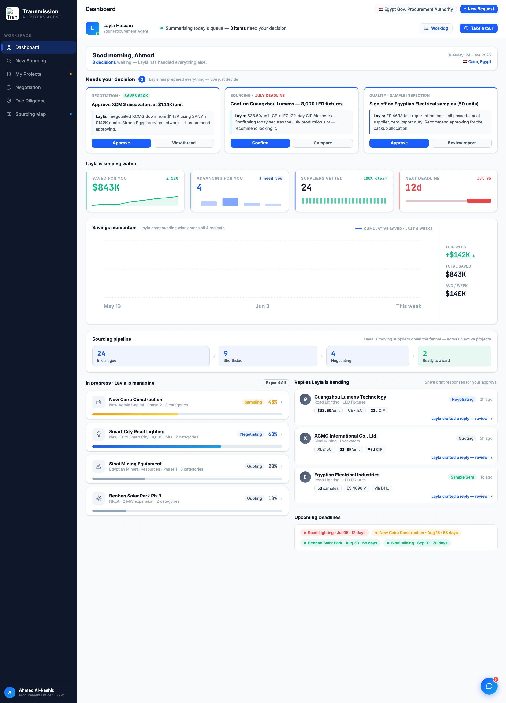
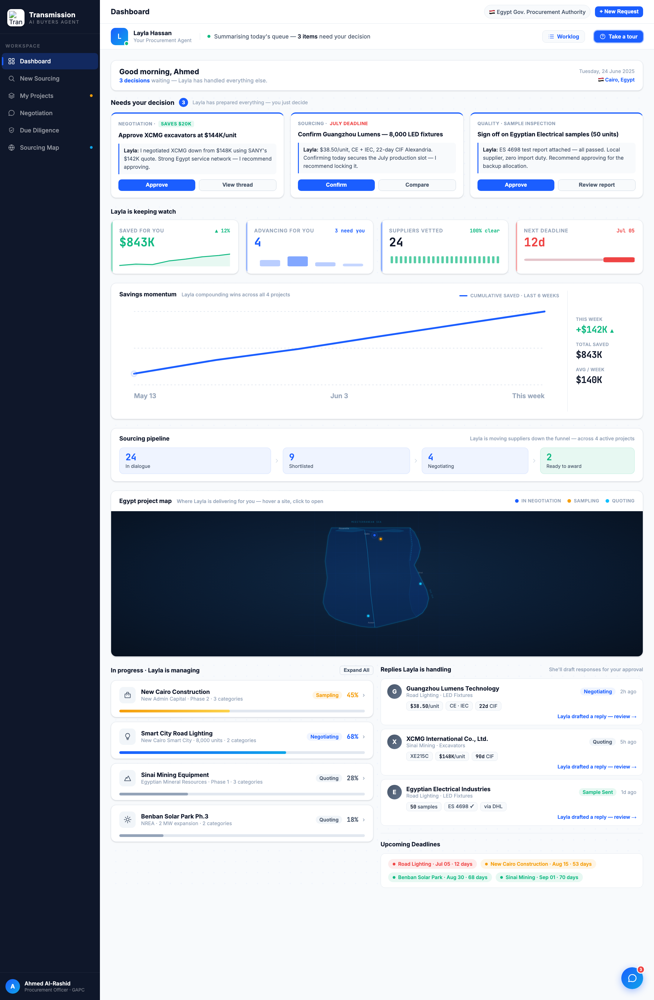

# Round 045 · 🟥 新组件 · Dashboard「Egypt project map」(factorygate 借鉴)· 自主模式

- 时间:2026-06-26 · 档位:🟥 新组件(自主模式不暂停)· backlog 来源:用户点名「参考 factorygate 加我没有的 component」+「多可视化 / 地图交互 / 科技感」
- **审计**:复看 factorygate ref —— 其 dashboard 有一个我**没有的**组件:**国内 Egypt 项目地图**(可辨识 Egypt 轮廓 + 项目 pin)。我只有全球供应商地图(view-map),缺买方**项目**的地理视图。
- **做了什么**:dashboard 在 Sourcing pipeline 与「In progress」之间新增 **Egypt project map 卡**:亮卡内嵌 command-center 深色画布(沿用 sourcing map 风格),adapt factorygate 的 Egypt SVG(轮廓 + Nile + Delta + Suez + Sinai + Red Sea + 网格 + Cairo/Alexandria/Aswan/海域 mono 标注);**我的 4 个真实项目**作 pin:Smart City Road Lighting(Cairo,蓝 In negotiation)/ New Cairo Construction(New Admin Capital,amber Sampling)/ Sinai Mining(Sinai,cyan Quoting)/ Benban Solar(Aswan,cyan Quoting)。hover 出 tooltip(项目+地点+状态+关键进展),click→procurement。legend = 3 语义色。
- **零 AI 味处理**:factorygate 的 pin 用 emoji(💡⛏🏗☀️)——**全部去掉**,换成脉冲环 + 实心色点(纯净 dot,无 emoji);pin 仅 3 语义色(蓝/amber/cyan)非彩虹撞色。
- **验收**:console 零错 ✓ · 截图确认 Egypt 轮廓 + 4 pin 地理就位 + tooltip(Sinai Mining/QUOTING/XCMG vs SANY $144K)✓ · 纯增量 dashboard 卡、未触任何既有逻辑、跨视图无回归 ✓ · 3 critic:
  - **产品**:KEEP —— 项目从文字列表多了**地理视图**:一眼看 Layla 在 Egypt 各地替你推进到哪;hover 出状态/进展,click 进项目。新增交互/游戏感地图于首页。
  - **视觉**:KEEP —— 亮卡 + command-center 深画布(与 sourcing map 一致),cyan Egypt + 3 语义 pin,零 emoji,mono 海域标注;高级。
  - **回归**:KEEP —— console 零错,tooltip 工作,additive,无既有逻辑改动。
  - 裁决:**3/3 KEEP**。
- **截图**:  
- **NOTABLE**:新增较大组件(自主模式未暂停)。与下方「In progress」列表略重叠(地图=地理视图 vs 列表=进度条,互补);如需可后续将列表并入地图卡右栏去重。
- **残留 → backlog**:Egypt map 可续(pin→对应项目高亮 / 项目列表并入卡右栏去重 / 选中 trace);决策卡抽组件;flag emoji。
- commit:见 git(cp index.html + push)
