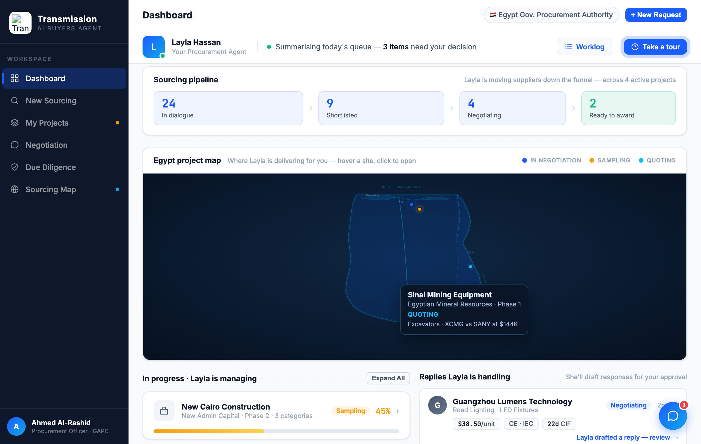
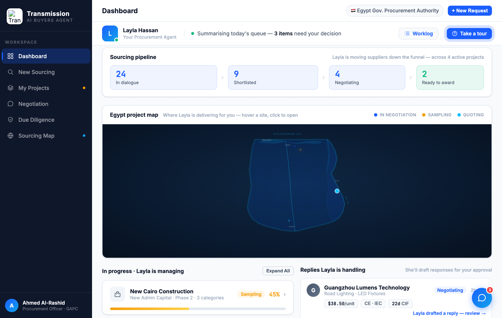

# Round 046 · 🟦 Standard · Egypt map ↔ 项目列表联动(去冗余)· 自主模式

- 时间:2026-06-26 · 档位:🟦 Standard · backlog 来源:R045 next(Egypt map pin ↔「In progress」列表去重/联动)
- **做了什么**:dashboard「In progress · Layla is managing」项目行 hover → 其在 Egypt map 上的对应 pin **点亮放大(白描边)**,其余 pin **淡出(.25)**。事件委托(`#dash-proj-list` 上 mouseover/mouseleave,按卡片序号 → pin 序号 `EG_DP2PINIDX=[1,0,2,3]`:NewCairo→p2 / SmartCity→p1 / Sinai→p3 / Benban→p4,地理正确)。把 R045 地图与列表的"轻重叠"变成**联动**:读列表即见地理位置。
- **验收**:console 零错 ✓ · 模拟 hover 卡[2](Sinai)→ 点亮 pin idx2(p3 Sinai)、dim 0/1/3,title=`LIT=2|DIM=0,1,3` ✓ · 截图确认 Sinai pin 亮、余 dim ✓ · 事件委托守卫(wrap 缺失即返回)· additive、未触既有逻辑、跨视图无回归 ✓ · 3 critic:
  - **产品**:KEEP —— 列表↔地图联动:hover 项目即见"在 Egypt 哪个位置推进",消解 R045 冗余、增交互。
  - **视觉**:KEEP —— 点亮(放大+白描边)/淡出 .25,无新色/emoji,克制高级。
  - **回归**:KEEP —— console 零错,委托守卫,mouseleave 清除,dashboard-only。
  - 裁决:**3/3 KEEP**。
- **截图**: 
- **残留 → backlog**:可加反向(pin hover→行高亮)/ 点击行→pin ping;决策卡抽组件;flag emoji。**大件 + Egypt map 组件均成型,余皆细件 → 趋近收敛。**
- commit:见 git(cp index.html + push)
