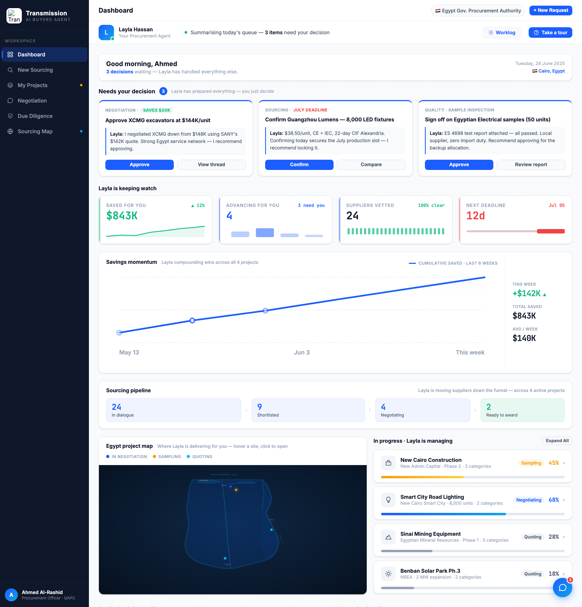
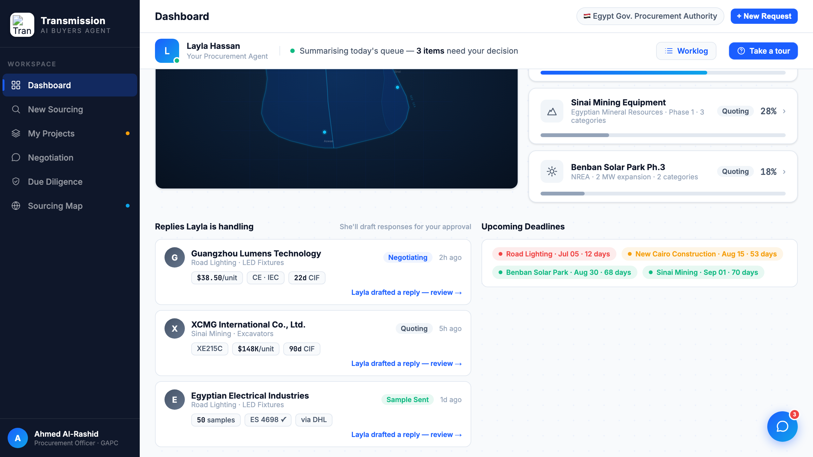

# Round 047 · 🟦 Standard · Dashboard 布局整合(减冗余/层级)· 自主模式

- 时间:2026-06-26 · 档位:🟦 Standard · backlog 来源:用户 #1 诉求「一登录就信息过载」+ R045 加 Egypt map 后与「In progress」列表(同 4 项目)重叠、堆叠拉长
- **审计**:dashboard scrollHeight 1904px / 视口 900 = **2.12 屏**;Egypt map(全宽)与项目列表(下方)展示同 4 项目 = 冗余 + 拉长。
- **做了什么**(布局重组,内容零删):
  1. **Egypt map + 项目列表并排**:由「map 全宽 → 列表在下」改为 2 列 `[map 1.35fr | In progress 列表 1fr]` —— 地图填满左列、列表贴右,R046 的 hover 行→点亮 pin 现在**相邻**更直觉。
  2. **Replies | Deadlines 2 列**:原 Replies 全宽下方 + Deadlines 再下 → 改 2 列并排,填满宽度、收紧高度。
  - 结果:scrollHeight 1904→**1803**(2.12→2.00 屏),布局更聚合分组。
- **验收**:console 零错 ✓ · 4 处 brace 重组后高度正常计算(无破版)✓ · **R046 联动保留**:模拟 hover 卡[1](Smart City)→ 点亮 pin0(p1)、dim 1/2/3,`LIT=0|DIM=1,2,3` ✓ · toggle 函数/expand 完好 · 跨视图无回归 ✓ · 3 critic:
  - **产品**:KEEP —— 首页重组为聚合单元(地图↔列表相邻联动 / Replies↔Deadlines 配对),更有层级、略短,缓解 overload 观感。
  - **视觉**:KEEP —— 均衡 2 列、无稀疏全宽,地图填列、deadline chips 成网格,无新色/emoji。
  - **回归**:KEEP —— console 零错,R046 联动 + toggle 保留,brace 平衡。
  - 裁决:**3/3 KEEP**。
- **截图**:  
- **残留 → backlog**:Replies/Deadlines 内容可再精简;反向 pin→行高亮;决策卡抽组件;flag emoji。**布局/组件大件全清,余皆细件。**
- commit:见 git(cp index.html + push)
