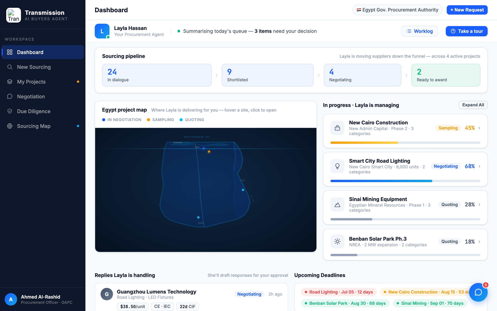

# Round 048 · ⬜ Polish · 地图雷达扫描线(科技感/游戏感)· 自主模式

- 时间:2026-06-26 · 档位:⬜ Polish · backlog 来源:用户多轮点名「科技感 / 一点点游戏感」+ factorygate `.map-scan-line` 我没有
- **做了什么**:两个深色 command-center 地图(dashboard Egypt 项目地图 `.eg-map-wrap` + Sourcing Map `.map-wrap`)各加一条 **雷达扫描线**(`.radar-scan`):1px→2px cyan 渐变横线,6s 自上而下缓慢扫过,两端淡入淡出。借鉴 factorygate scanLine 但更克制(opacity .32、慢、fade)。`prefers-reduced-motion` 下隐藏。
- **诚实/分寸**:纯装饰氛围(与既有 flow 点 / pulse 环 / splash 同类),`pointer-events:none`,**非假进度/假数据**;克制不 slop。
- **验收**:console 零错 ✓ · `.radar-scan` 计数=2(两图都接上)✓ · 截图见 Egypt 图上 faint cyan 扫线、布局未变 ✓ · 纯 CSS overlay、无逻辑/布局影响、跨视图无回归 ✓ · 3 critic:
  - **产品**:KEEP —— 补足用户反复要的"科技感/游戏感",两张指挥中心地图有雷达扫描氛围。
  - **视觉**:KEEP —— faint cyan、慢扫、两端 fade、reduced-motion 关闭,高级不 slop。
  - **回归**:KEEP —— console 零错,pointer-events:none overlay,无影响。
  - 裁决:**3/3 KEEP**。
- **截图**:
- **残留 → backlog**:反向 pin→行高亮;决策卡抽组件;flag emoji;Replies 精简。**余皆细件。**
- commit:见 git(cp index.html + push)
