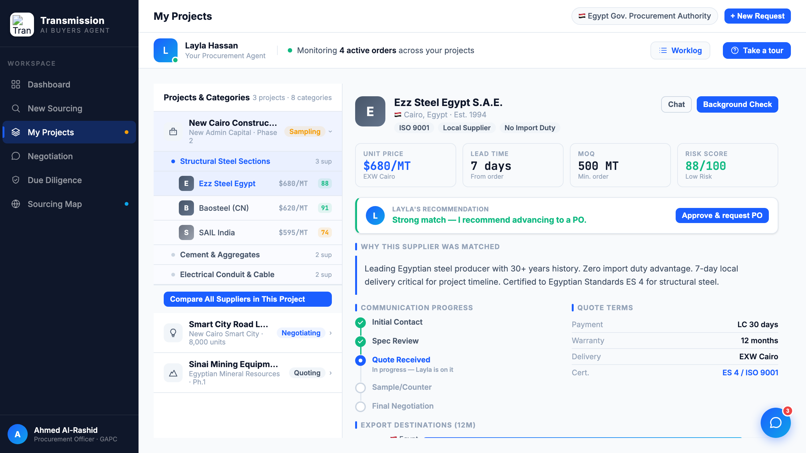

# Round 050 · ✅ 审计+修 · 验证 tour 未被 R047 破坏 + 补全树评分(17→19)· 自主模式

- 时间:2026-06-26 · 档位:✅ 审计 + ⬜ 小修 · backlog 来源:R047 重组后回归核查 + R049 残留(2 行无评分)
- **审计(关键回归核查)**:R047 重组 dashboard(map+列表并排 / Replies|Deadlines 2 列)后,核对 **guided tour** 10 步 `sel:` 目标:`.agent-bar` / `#dec-grid` / `.grid-4` / `.agent-tour` / `.sidebar` / `#idea-input` / `.proj-tree-layout` / `.neg-decision` / `.dd-form-card` —— **全是稳定元素,无一指向 R047 移动的块(In-progress 列表 / Egypt map / Replies)**。→ **tour 未被破坏,无回归**。
- **修(R049 补全)**:R049 树评分 17/19 缺 2 行 —— 根因:2 行 row id 用短名(`smr-cat` / `smr-suez`)而 SUPPLIERS 键是全名(`caterpillar` / `suez_cement`)。`decorateTreeScores` 改为**从 onclick 实参解析真实键**(`selectSupplier\('([^']+)'`),回退才用 row id。现 **19/19 全评分**(Caterpillar 92 / Suez Cement 85)。注:这 2 行 onclick 本就用全名,点击无 bug,仅徽章缺失。
- **验收**:console 零错 ✓ · ROWS=19 / SCORED=**19** / CAT=92 / SUEZ=85 ✓ · 幂等 · 仅 procurement、跨视图无回归 ✓ · tour 选择器全部存活(审计)✓ · 3/3 KEEP(产品:特性补全 + 回归排除;视觉:徽章一致;回归:console 零错稳健解析)。
- **截图**:
- **残留 → backlog**:反向 pin→行高亮;决策卡抽组件(decApprove/negDecide/procApprove/decorate 归一);flag emoji。**大件全清,余皆细件 → 收敛态。**
- commit:见 git(cp index.html + push)
