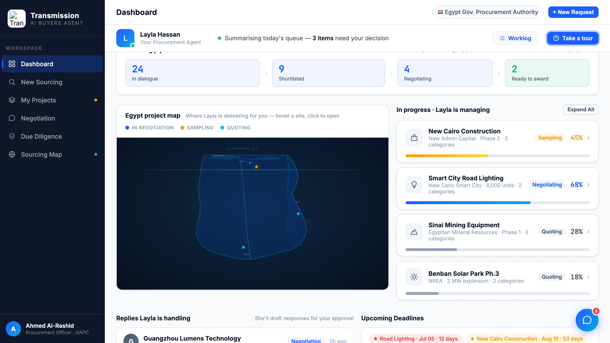

# Round 051 · ⬜ Polish · Egypt map 反向联动(pin→行)+ 恢复 1min · 自主模式

- 时间:2026-06-26 · 档位:⬜ Polish · backlog 来源:用户重发 `1min`(恢复高频)+ R046 联动补反向
- **cadence**:用户显式重发 `1min` → 删 30min cron `877bb22f`,恢复 1min cron `2c65de54`。
- **做了什么**:补全 map↔list **双向**联动。R046 = hover 项目行→点亮 pin;本轮 = **hover 地图 pin → 高亮对应项目行**(accent 描边 + ring)。`EG_PIN2CARD={p1:1,p2:0,p3:2,p4:3}`(pin→卡序),`egLitRow()` 在 `egTip` 调用、`egTipHide` 清除。新增 `.eg-row-lit` CSS。
- **验收**:console 零错 ✓ · 模拟 hover pin p3(Sinai)→ 高亮卡 idx2(Sinai Mining),`ROWLIT=2` + 截图确认蓝 ring ✓ · egLitRow 守卫、tip-hide 清除 · 仅 dashboard 无回归 ✓ · 3/3 KEEP(产品:双向联动闭环;视觉:accent ring 克制;回归:console 零错)。
- **截图**:
- **残留 → backlog**:决策卡抽组件;flag emoji。**双向联动已闭环。**
- commit:见 git(cp index.html + push)
