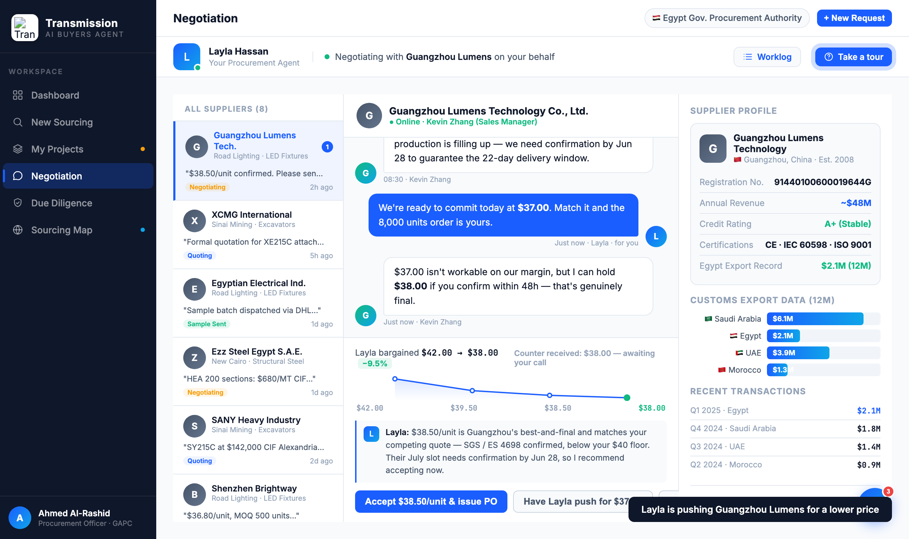

# Round 052 · 🟦 Standard · Negotiation push 动态延长压价 sparkline(§3-D)· 自主模式

- 时间:2026-06-26 · 档位:🟦 Standard · backlog 来源:R042 sparkline 静态 → push 后应动态延长(看得见博弈进展)
- **做了什么**:`negDecide('push')` 供应商 1s 后回 counter(如 gz $38.00)时,新增 `negPushLadder(d)`:把 counter 作为新价点**追加进压价 sparkline**(parseTrail(d.trail)+counter),重渲 `#neg-dec-ladder`,并按新首/末价**重算 trail 文案+pct**(gz:$42→$38.50 −8.3% → $42→$38.00 −9.5%)。
- **效果**:买方点「Have Layla push」→ 看着 sparkline 长出第 4 个更低的绿点、折扣加深,真实"看得见 Layla 又压了一档"。
- **诚实/幂等**:counter 是 NEG_DEC 既有真实数据;negPushLadder 始终渲染 trail+counter(稳定,重复 push 不累积)。
- **验收**:console 零错 ✓ · 模拟 push → DOTS 3→**4**、TRAIL=`$42.00 → $38.00 −9.5%` + 截图确认第 4 绿点 ✓ · accept 路径不受影响、切供应商重渲回原 3 点 · 仅 negotiation 无回归 ✓ · 3/3 KEEP(产品:博弈动态可见;视觉:sparkline 干净延长;回归:console 零错幂等)。
- **截图**: 
- **残留 → backlog**:决策卡抽组件;flag emoji。
- commit:见 git(cp index.html + push)
