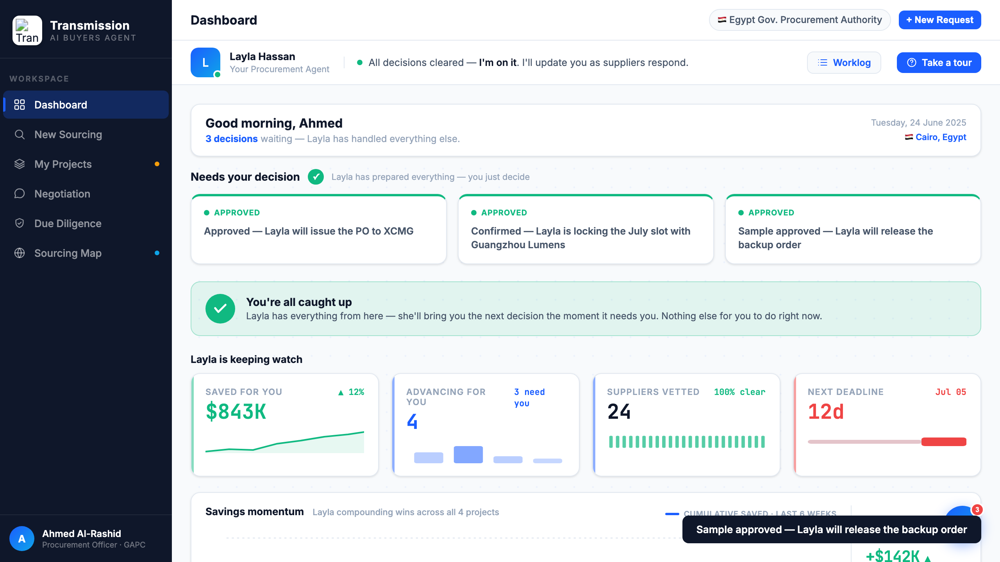

# Round 053 · 🟦 Standard · Dashboard「全部处理完」安心感收尾(§3-G)· 自主模式

- 时间:2026-06-26 · 档位:🟦 Standard · backlog 来源:审计 decApprove —— 批完 3 张决策卡只剩 3 张绿「Approved」+ count 0,缺满足感收尾(§3-G 安心感)
- **做了什么**:批准最后一张决策卡(`remaining===0`)时,dec-grid 下方滑出绿色 **「You're all caught up」** 安心横幅(check 图标 +「Layla 已接管,下个需你决策的会第一时间端来,现在你无事可做」);nyd-count → 绿色 **✓**;agent-bar 状态已有「All decisions cleared — I'm on it」。
- **效果**:买方清空决策队列后得到明确「看→决策→放心,剩下交给 Layla」的收尾(north-star-2 §3 零负担+安心)。
- **验收**:console 零错 ✓ · 批 3 张 → `ALLCLEAR=flex` / `COUNT=✓` + 截图确认绿横幅 + 3 绿 Approved 卡 + agent 状态更新 ✓ · 横幅默认 display:none(仅 remaining=0 显示)· 纯增量、dashboard-only、无回归 ✓ · 3/3 KEEP(产品:决策闭环安心收尾;视觉:绿安心卡+SVG勾,无 emoji;回归:console 零错守卫)。
- **截图**:
- **残留 → backlog**:决策卡抽组件;flag emoji。
- commit:见 git(cp index.html + push)
