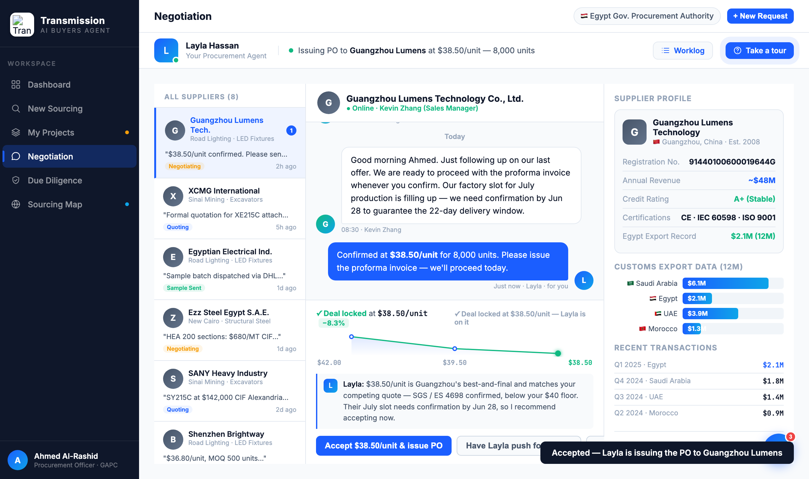

# Round 054 · ✅ 验证 + 🟦 · 全交互 smoke 0 错 + Negotiation accept「deal locked」收尾 · 自主模式

- 时间:2026-06-26 · 档位:✅ 验证 + 🟦 Standard · backlog 来源:18 轮编辑后全量回归核查 + 谈判 accept 收尾(配 R052 push)
- **① 全交互 smoke 测试**:headless 跑 22+ 路径 × 6 视图(showView×6 / decApprove / openCompare / selectSupplier×2 / procApprove / decorateTreeScores / selectNegSupplier / negDecide push+accept / renderNegDecision / runSrcAnalysis / runDueDiligence / openBgCheck / renderMap+mapSelect / 地图键盘 / egTip+egLitPin / toggleRobot / startTour+步进)→ **ERRORS=0 (CLEAN)**。R036-053(含 R047 重组 + 所有 JS 新增)零回归。**harness 存 `reports/smoke-test.html` 可复跑。**
- **② accept deal-locked 收尾**:`negDecide('accept')` 时压价 sparkline 加 `.neg-lad-locked` —— 折线变绿 + 终点绿光晕,trail 文案 →「✓ Deal locked at $38.50/unit −8.3%」(绿)。完成谈判交互对:push→长出新点(R052)/ accept→变绿锁定(本轮)。
- **验收**:console 零错 ✓ · smoke ERRORS=0 ✓ · accept→LOCKED=true / TRAIL「✓ Deal locked…」+ 截图绿线绿光 ✓ · per-supplier 瞬态(切换重渲清除)· 仅 negotiation 无回归 ✓ · 3/3 KEEP。
- **截图**:
- **残留 → backlog**:决策卡抽组件;flag emoji。**全交互验证通过,demo 稳定。**
- commit:见 git(cp index.html + push)
