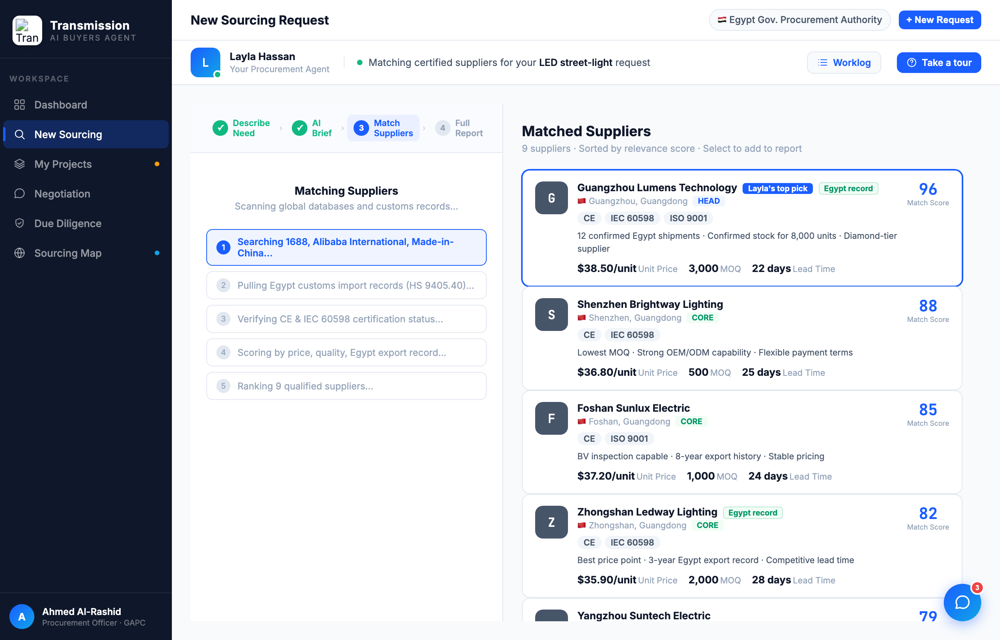

# Round 055 · 🟦 Standard · Sourcing 结果「Layla's top pick」高亮(§3-E)+ 去 Egypt Record emoji · 自主模式

- 时间:2026-06-26 · 档位:🟦 Standard · backlog 来源:审计发现 sourcing 匹配结果所有供应商卡同款,**Layla 的 #1 推荐(Guangzhou 96)无突出** —— 违 §3-E(助理推荐,别让买方自己比分)
- **审计**:above-the-fold dashboard 复核 = 干净有层级、非过载,不强改。转 sourcing 结果卡。
- **做了什么**(`renderSupplierCards`):排名第一(`i===0`,MATCH_SUPPLIERS 按 relevance/score 排序)的卡加 **「Layla's top pick」蓝徽章** + `.smc-top` accent 描边(`box-shadow ring`),一眼可见 Layla 的首推。同时把装饰性 `🇪🇬 Egypt Record` 徽章去 emoji → 纯文本「Egypt record」(供应商原产国功能性 `${s.flag}` 国旗保留)。
- **验收**:console 零错 ✓ · DOM 检查 TOP=true / PICK=true ✓ · 驱动到 Match Suppliers 阶段截图确认:Guangzhou 卡蓝徽章 + accent 边 + 96 分,其余卡无;Egypt record 徽章无 emoji ✓ · renderSupplierCards 双容器渲染、仅 sourcing 无回归 ✓ · 3/3 KEEP(产品:首推即时可见;视觉:accent 徽章+边、去 emoji;回归:console 零错 i===0 only)。
- **截图**:
- **残留 → backlog**:决策卡抽组件;其余功能性国旗(低优先)。
- commit:见 git(cp index.html + push)
